# Manual de usuario — CNC Portal (CnCApp)

**Sistema de gestión de capacitaciones y certificaciones**  
**Propietario:** Consejo Nacional de Competencias (CNC) del Ecuador  

**Versión del documento:** 1.1 (marzo 2026)  
**Audiencia:** Usuarios finales, administradores institucionales, conferencistas y personal de soporte.

---

## Tabla de contenidos

1. [Introducción](#1-introducción)
2. [Qué es el sistema y qué problemas resuelve](#2-qué-es-el-sistema-y-qué-problemas-resuelve)
3. [Arquitectura general (visión de usuario)](#3-arquitectura-general-visión-de-usuario)
4. [Requisitos de acceso](#4-requisitos-de-acceso)
5. [Navegación en la aplicación](#5-navegación-en-la-aplicación)
6. [Área pública (sin iniciar sesión)](#6-área-pública-sin-iniciar-sesión)
7. [Cuenta, sesión y seguridad](#7-cuenta-sesión-y-seguridad)
8. [Roles y permisos](#8-roles-y-permisos)
9. [Manual por rol](#9-manual-por-rol)
10. [Catálogos y datos maestros (administración)](#10-catálogos-y-datos-maestros-administración)
11. [Capacitaciones y eventos](#11-capacitaciones-y-eventos)
12. [Inscripciones, asistencia y roles en el evento](#12-inscripciones-asistencia-y-roles-en-el-evento)
13. [Certificados digitales y validación](#13-certificados-digitales-y-validación)
14. [Plantillas de certificado](#14-plantillas-de-certificado)
15. [Reportes y estadísticas](#15-reportes-y-estadísticas)
16. [Aplicación móvil (Android)](#16-aplicación-móvil-android)
17. [Mensajes frecuentes y resolución de incidencias](#17-mensajes-frecuentes-y-resolución-de-incidencias)
18. [Glosario](#18-glosario)
19. [Contacto y soporte](#19-contacto-y-soporte)

---

## 1. Introducción

Este manual describe el uso de **CnCApp** (marca de producto **CNC Portal** en la interfaz), la plataforma web y móvil mediante la cual el CNC gestiona **capacitaciones** (eventos de formación), **inscripciones**, **control de asistencia**, **certificados con código QR** y **reportes** consolidados.

El documento está redactado desde la perspectiva del **usuario final**. No sustituye la documentación técnica para desarrolladores (API, despliegue, base de datos), que permanece en la carpeta `docs/` del repositorio.

---

## 2. Qué es el sistema y qué problemas resuelve

### 2.1 Funciones principales

| Función | Descripción breve |
|--------|-------------------|
| **Gestión de capacitaciones** | Alta, edición y seguimiento de eventos con fechas, modalidad, cupos, ubicación o enlace virtual, horas y estado. |
| **Inscripción de participantes** | Los usuarios pueden inscribirse en eventos disponibles; el personal autorizado gestiona listas e inscripciones manuales. |
| **Asistencia** | Registro de asistencia (incluye flujo con **código QR** del evento para el participante). |
| **Certificados** | Emisión de certificados digitales con **código único** y posibilidad de **validación pública** escaneando o ingresando el código. |
| **Administración** | Usuarios, roles con módulos, entidades, geografía (provincia, cantón, parroquia), instituciones, cargos, competencias, grados ocupacionales, plantillas. |
| **Reportes** | Panel con indicadores, filtros y exportación a **PDF**. |

### 2.2 Componentes del proyecto (contexto)

- **Frontend:** aplicación **Angular + Ionic** (interfaz responsive; puede empaquetarse como app **Android** con Capacitor).
- **Backend:** API REST en **Node.js** con base de datos **PostgreSQL**.
- **Despliegue típico:** contenedores **Docker** con proxy **Nginx** (según documentación del repositorio).

Para el usuario, lo relevante es la **URL del portal** que proporcione la institución y un **navegador actualizado** o la **app instalada**.

---

## 3. Arquitectura general (visión de usuario)

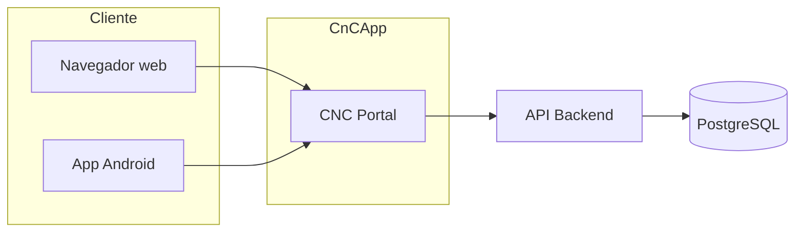

La interfaz **CNC Portal** concentra:

- **Menú lateral** (icono hamburguesa en móvil): inicio, sesión, módulos según rol, información institucional, validación de certificados y cierre de sesión.
- **Barra superior (header)** en pantallas amplias: accesos rápidos según el tipo de usuario (invitado, administrador, conferencista, usuario/participante).

Los **permisos** no dependen solo del “nombre del rol”: el **administrador** asigna a cada rol una lista de **módulos** (pantallas permitidas). Si intenta entrar a una ruta sin el módulo correspondiente, el sistema muestra un mensaje de acceso denegado.

---

## 4. Requisitos de acceso

### 4.1 Navegador y red

- Navegadores modernos (Chrome, Edge, Firefox, Safari) actualizados.
- Conexión a Internet estable.
- Para **escaneo de QR** (validación de certificados o asistencia): **cámara** y permisos del navegador; en entornos restringidos puede usarse **entrada manual** del código cuando la pantalla lo permita.

### 4.2 Credenciales

- Identificación con **cédula (CI)** y **contraseña** definida en el registro o asignada por un administrador.
- La institución puede habilitar **registro público** (`/register`) según su política.

### 4.3 Entornos

En desarrollo local, el README del proyecto indica frontend en `http://localhost:4200` y backend en `http://localhost:3000`; en **Docker**, el acceso unificado suele documentarse como `http://localhost` para el frontend. **En producción, use siempre la URL oficial** que le indique el CNC.

---

## 5. Navegación en la aplicación

### 5.1 Página de inicio (`/home`)

- Punto de entrada tras abrir el portal.
- Muestra información contextual según si hay sesión iniciada (resúmenes, enlaces).
- Desde aquí se accede al resto de secciones mediante menú o header.

### 5.2 Menú lateral

Secciones habituales:

| Sección | Contenido |
|---------|-----------|
| **Inicio** | Vuelve al tablero principal. |
| **Iniciar sesión / Crear cuenta** | Visible si no hay sesión. |
| **Mi perfil** | Con sesión iniciada. |
| **Gestión** | Lista dinámica: cada ítem es un **módulo** asignado al rol (texto exacto configurado en el rol). |
| **Asistencia QR** | Visible para el perfil de **usuario/participante** en el menú (además de otros accesos). |
| **Información** | Acerca de nosotros, dirección, historia, normativa, servicios y programas. |
| **Validar certificados** | Acceso público a la validación por QR o código. |
| **Cerrar sesión** | Limpia la sesión local y redirige al login. |

### 5.3 Barra superior (header)

Varía según el estado:

- **Invitado:** enlaces a secciones públicas y **Validar**.
- **Administrador:** Dashboard, Usuarios, Conferencias, Reportes, Sitio público.
- **Conferencista:** Inicio, Eventos, Plantillas, Sitio público.
- **Usuario (participante):** Inicio, Explorar (conferencias), Asistencia QR, Mis certificados, Sitio público.

En la parte derecha: acceso a **perfil** (avatar / nombre) e icono de **salida**.

---

## 6. Área pública (sin iniciar sesión)

### 6.1 Información institucional (`/home/...`)

Rutas típicas:

| Ruta | Contenido orientativo |
|------|------------------------|
| `/home/informacion` | Información general “Acerca de nosotros”. |
| `/home/direccion` | Ubicación y datos de contacto físicos. |
| `/home/historia` | Antecedentes institucionales. |
| `/home/norma-regul` | Marco normativo. |
| `/home/servi-progra` | Servicios y programas. |

### 6.2 Catálogo de capacitaciones (`/catalogo-capacitaciones`)

Permite **explorar** el oferta de eventos con:

- Búsqueda por texto (nombre, descripción, lugar).
- Filtros por **modalidad**, **carga horaria**, opción de ver solo eventos **en los que no está inscrito** (si aplica con sesión).
- Orden por recencia, duración o nombre.

La **inscripción** concreta puede requerir iniciar sesión según las reglas de negocio implementadas en cada pantalla de detalle.

### 6.3 Validar certificados (`/validar-certificados`)

- Permite comprobar la **autenticidad** de un certificado mediante **escaneo de QR** o **código/hash** (también vía parámetro en URL cuando se comparte un enlace).
- No requiere cuenta: es el mecanismo de **verificación pública** frente a terceros (empleadores, instituciones, etc.).

---

## 7. Cuenta, sesión y seguridad

### 7.1 Iniciar sesión (`/login`)

- Ingrese **cédula** y **contraseña**.
- El sistema puede integrar **reCAPTCHA** u otros controles anti-abuso según configuración del despliegue.
- Tras un login correcto se almacenan de forma local el **token de acceso** y datos básicos del usuario para mantener la sesión.

### 7.2 Registro (`/register`)

- Formulario de alta de usuario según los campos definidos en la aplicación (datos personales, contacto, contraseña, etc.).
- Puede estar sujeto a validaciones (por ejemplo, formato de cédula ecuatoriana en el backend).

### 7.3 Recuperación de contraseña (`/recuperar-password`)

- Flujo para solicitar restablecimiento según la implementación actual (correo o procedimiento interno). Use los datos que el formulario solicite.

### 7.4 Inicio de sesión biométrico (dispositivos compatibles)

En entornos móviles compatibles, la aplicación puede ofrecer **login con biometría** tras haber configurado previamente el vínculo en el dispositivo. Si falla, use **cédula y contraseña**.

### 7.5 Cierre de sesión

- Use **Cerrar sesión** en el menú o el icono de salida en el header.
- Si un administrador **cambia su rol o módulos**, puede ser necesario **volver a iniciar sesión** para que los permisos se actualicen (el sistema puede alertar de cambios de permisos en determinadas condiciones).

### 7.6 Buenas prácticas

- No comparta su contraseña.
- Cierre sesión en equipos compartidos.
- Verifique que la URL sea la **oficial** del CNC antes de ingresar credenciales.

---

## 8. Roles y permisos

### 8.1 Conceptos

- **Rol:** etiqueta de perfil (por ejemplo, Administrador, Conferencista, Usuario). El nombre exacto debe coincidir con lo configurado en base de datos (mayúsculas/minúsculas pueden afectar comparaciones en ciertas pantallas).
- **Módulos:** lista de strings (etiquetas) asociadas al rol. Cada módulo se mapea internamente a una **ruta** del sistema. Si falta el módulo en su rol, verá “Acceso denegado” al intentar abrir esa sección.

### 8.2 Roles definidos en el sembrado de datos de referencia (`seed`)

El proyecto incluye un archivo de semilla que define tres roles base (en despliegues reales pueden existir más):

| Rol (nombre en BD) | Código | Módulos incluidos en semilla |
|--------------------|--------|------------------------------|
| **Administrador** | `ADMIN` | Ver Perfil, Ver conferencias, Gestionar roles, Gestionar capacitaciones, Gestionar usuarios, Gestionar entidades, Gestionar provincias, parroquias y cantones, Gestionar competencias, Gestionar instituciones, Gestionar plantillas, Gestionar reportes, Gestionar grados ocupacionales, Gestionar cargos, Validar certificados. |
| **Conferencista** | `CONFERENCISTA` | Ver Perfil, Ver conferencias, Gestionar capacitaciones, Gestionar plantillas, Validar certificados. |
| **Usuario** | `USUARIO` | Ver Perfil, Ver conferencias. |

> **Nota:** En documentación comercial a veces se habla de “Participante”; en el código del frontend el participante está alineado con el rol cuyo nombre es **Usuario** (`isUser` comprueba `usuario` o `participante` en minúsculas). Si su pantalla muestra otro nombre, la lógica de menú puede variar; ante dudas, consulte con el administrador del sistema.

### 8.3 Rutas administrativas protegidas

- Las rutas bajo `/gestionar-*` (excepto configuraciones específicas) exigen ser **Administrador** y, en muchos casos, tener el **módulo** homónimo en el rol.
- Las rutas bajo `/conferencista/...` exigen rol **Conferencista** o **Administrador** (guard dedicado).

### 8.4 Hub de configuración maestros (`/configuracion-maestros`)

- Solo **Administrador**.
- No sustituye al menú de módulos: es un **centro visual** que agrupa accesos a provincias, cantones, parroquias, entidades, instituciones, cargos, grados y competencias.

---

## 9. Manual por rol

### 9.1 Usuario / participante

**Objetivo:** inscribirse, asistir y conservar certificados.

| Acción | Dónde |
|--------|--------|
| Ver y editar datos personales | `/ver-perfil`, `/ver-perfil/editar` |
| Registrar firma (si aplica) | `/ver-perfil/firma` |
| Ver logros o historial (si aplica) | `/ver-perfil/logros` |
| Explorar e inscribirse en eventos | `/ver-conferencias` y/o `/catalogo-capacitaciones` |
| Confirmar asistencia con QR del evento | `/confirmar-asistencia` |
| Listar y descargar certificados propios | `/mis-certificados` |

**Asistencia QR:** al escanear el código del evento, el sistema asocia la asistencia con su usuario autenticado. Si la cámara no está disponible, use la opción de **entrada manual** si la interfaz la ofrece en su versión.

### 9.2 Conferencista

**Objetivo:** crear y mantener eventos, gestionar inscritos y apoyar la emisión de certificados, sin acceso completo a todos los catálogos del administrador.

| Funcionalidad | Ruta |
|---------------|------|
| Listado y CRUD de capacitaciones | `/conferencista/gestionar-capacitaciones` (+ crear/editar/visualizar inscritos) |
| Gestión de plantillas | `/conferencista/gestionar-plantillas` |
| Pantalla de certificados por capacitación | `/conferencista/certificados/:id` |

Las pantallas reutilizan los mismos componentes que el administrador, pero el **prefijo de URL** y las **reglas de guard** limitan el alcance.

**Redirecciones legacy:** rutas antiguas `creator/*` redirigen a `conferencista/*`.

### 9.3 Administrador

**Objetivo:** gobierno completo de la plataforma, catálogos, usuarios, reportes y políticas de certificación.

Incluye todo lo del conferencista **más**:

- **Roles** (`/gestionar-roles`): definición de nombre, descripción, estado y **módulos** JSON.
- **Usuarios** (`/gestionar-usuarios`): alta, edición, detalle; asignación de rol, entidad y datos extendidos (ubicación, tipo de participante, institución, etc.).
- **Reportes** (`/gestionar-reportes`): KPIs, gráficos, filtros por fechas, entidad y modalidad; **exportar PDF**.
- **Maestros** vía menú o `/configuracion-maestros`.

---

## 10. Catálogos y datos maestros (administración)

Cada ítem suele seguir el patrón **listado → crear → editar**. Los nombres de ruta son autodescriptivos.

### 10.1 Geografía

| Catálogo | Ruta base |
|----------|-----------|
| Provincias | `/gestionar-provincias` |
| Cantones | `/gestionar-cantones` |
| Parroquias | `/gestionar-parroquias` |

**Jerarquía:** provincia → cantón → parroquia. Al crear cantones y parroquias, seleccione correctamente el padre territorial.

### 10.2 Organización y talento humano

| Catálogo | Ruta base | Uso típico |
|----------|-----------|------------|
| Entidades | `/gestionar-entidades` | Organismos que encargan o coparticipan en capacitaciones. |
| Instituciones (sistema) | `/gestionar-instituciones` | Catálogo de instituciones para vincular a usuarios y reportes. |
| Cargos | `/gestionar-cargos-instituciones` | Denominaciones de cargos. |
| Grados ocupacionales | `/gestionar-grados` | Niveles o escalafón. |
| Competencias | `/gestionar-competencias` | Competencias asociadas a funcionarios GAD en el modelo de datos. |

### 10.3 Catálogos especiales en base de datos

El esquema incluye tablas de apoyo que pueden poblarse por **semillas** o procesos internos (no siempre tienen CRUD visible en el menú principal):

- **GadParroquia:** catálogo plano amplio de parroquias GAD.
- **Educación básica:** instituciones de educación general básica y bachillerato para vínculos con usuarios.
- **Mancomunidades**, **tipos de institución**, **género**, **etnia**, **nacionalidad**, **tipo de participante**, **régimen especial**, etc.

Si necesita modificar datos que no aparecen en el menú, coordine con el **administrador de base de datos** o el equipo técnico.

---

## 11. Capacitaciones y eventos

### 11.1 Campos conceptuales de un evento

Al crear o editar una capacitación, suele registrarse:

- **Nombre** y **descripción**
- **Tipo de evento** (texto libre o catálogo según implementación)
- **Fechas** de inicio y fin, **horas** de inicio/fin y **carga horaria**
- **Modalidad** (p. ej. presencial, virtual, híbrica — según valores usados en la institución)
- **Lugar** y/o **coordenadas** (latitud/longitud)
- **Enlace virtual** para modalidades en línea
- **Cupos**
- **Estado** (activa, finalizada, etc.)
- **Plantilla** de certificado asociada (opcional)
- **Indicador** de si el evento **otorga certificado**
- **Código QR del evento** para flujo de asistencia
- **Entidades encargadas** (relación muchos a muchos en el modelo de datos)

### 11.2 Listado administrativo

En `/gestionar-capacitaciones` (o ruta conferencista equivalente) puede:

- Crear un nuevo evento.
- Editar uno existente.
- Abrir **visualización de inscritos** por evento.

### 11.3 Estados y coherencia

Respete las reglas de negocio del sistema: por ejemplo, no elimine indiscriminadamente eventos con inscripciones o certificados sin conocer el impacto en integridad referencial (el backend puede restringir borrados en cascada).

---

## 12. Inscripciones, asistencia y roles en el evento

### 12.1 Inscripción

- El participante puede inscribirse desde las vistas de conferencias / catálogo cuando la aplicación lo permita.
- El **administrador o conferencista** puede gestionar la lista desde **Visualizar inscritos** (`.../visualizar-inscritos/:id`).

### 12.2 Visualización de inscritos (gestión del evento)

Desde esta pantalla, el personal autorizado puede:

- Ver **participantes** y **expositores** por separado.
- **Filtrar** por término de búsqueda y estado de asistencia.
- **Marcar asistencia** o ajustarla según los botones disponibles.
- **Agregar** participantes desde un buscador de usuarios del sistema.
- **Generar / mostrar QR del evento** para que los asistentes confirmen presencia.
- Gestionar **roles en la capacitación** (p. ej. participante vs expositor, según enumeraciones del sistema).
- Acceder a flujos de **certificados** o exportaciones si la UI los expone en esa vista.

### 12.3 Rol dentro del evento vs rol del sistema

- **Rol del sistema** (Administrador, Conferencista, Usuario): define qué pantallas puede abrir.
- **Rol en la capacitación** (p. ej. Participante, Expositor): define cómo aparece en el evento y puede incidir en certificación o listados.

---

## 13. Certificados digitales y validación

### 13.1 Emisión

- Los certificados se generan con un **código QR único** almacenado en base de datos.
- La generación masiva o individual está ligada a la **capacitación**, a la **plantilla** y a que el participante cumpla las condiciones (p. ej. asistencia registrada, evento marcado para certificar — según reglas implementadas en backend y pantalla de certificados).

### 13.2 Participante: “Mis certificados”

En `/mis-certificados` el usuario ve el **listado** de certificados obtenidos y puede:

- **Previsualizar** o **descargar** PDF si el servidor expone `pdf_url` o generación en cliente.
- Abrir detalle de un certificado concreto si la URL incluye parámetros de capacitación.

### 13.3 Validación pública

1. Entre a **Validar certificados**.
2. **Escanee** el QR del certificado o **pegue** el código/hash.
3. El sistema consulta la API y muestra si el documento es **válido** o no, con datos del evento y participante según privacidad configurada.

### 13.4 Enlaces con parámetros

- Validación: puede abrirse con `?hash=...` en la URL para pruebas o enlaces profundos.
- Asistencia: la pantalla de confirmación puede aceptar parámetros de consulta según versión (`?qr=...`).

---

## 14. Plantillas de certificado

- Ruta administrativa: `/gestionar-plantillas` (o `/conferencista/gestionar-plantillas`).
- Permite definir **plantillas** con imagen de fondo y **configuración** (JSON) para posicionar textos, QR y elementos visuales en la generación del PDF.
- Las capacitaciones pueden **asociarse** a una plantilla concreta.

> La edición avanzada de `configuracion` puede requerir conocimiento técnico; para cambios complejos, solicite apoyo al equipo de desarrollo.

---

## 15. Reportes y estadísticas

- Ruta: `/gestionar-reportes` (requiere módulo **Gestionar reportes** y rol administrador en la práctica de despliegue).
- Incluye **tarjetas KPI**, gráficos de tendencia y distribución por roles.
- **Filtros:** rango de fechas, entidad, modalidad.
- **Exportar PDF:** genera un archivo descargable con el estado actual del tablero filtrado.

---

## 16. Aplicación móvil (Android)

El frontend se puede empaquetar con **Capacitor**:

1. Compilar el proyecto web (`npm run build` en `frontend`).
2. Sincronizar con `npx cap sync android`.
3. Abrir el proyecto en **Android Studio** y generar APK/AAB.

**Identificador de aplicación** de referencia en documentación: `ec.gob.cnc.app`.  
El comportamiento funcional es el del portal web, con adaptación a pantalla táctil y posibles permisos extra (cámara, biometría).

---

## 17. Mensajes frecuentes y resolución de incidencias

| Situación | Qué hacer |
|-----------|------------|
| “Debe iniciar sesión” | Use `/login`; si perdió la contraseña, `/recuperar-password`. |
| “Esta sección es solo para administradores” | Su rol no es administrador; solicite el rol adecuado o use la URL correcta para conferencista. |
| “No tienes el permiso necesario (Gestionar …)” | Su rol no incluye ese **módulo**; un administrador debe actualizar el rol. |
| “Sin permisos” (conferencista) | Solo Conferencista o Administrador pueden acceder a `/conferencista/*`. |
| Cámara no funciona en QR | Conceda permisos al navegador; pruebe otro navegador; use entrada manual si existe. |
| Datos desactualizados tras cambio de rol | Cierre sesión y vuelva a entrar. |
| Error al cargar estadísticas o PDF | Verifique conexión; reintente; si persiste, reporte al soporte con fecha/hora y captura. |

---

## 18. Glosario

| Término | Significado |
|---------|-------------|
| **CNC** | Consejo Nacional de Competencias del Ecuador. |
| **Capacitación** | Evento de formación gestionado en el sistema. |
| **CI** | Cédula de identidad (usuario de login). |
| **JWT / Token** | Mecanismo técnico de sesión tras el login. |
| **Módulo** | Etiqueta de permiso asociada a un rol que habilita una sección. |
| **Plantilla** | Diseño base del certificado PDF. |
| **QR** | Código bidimensional para validación rápida o asistencia. |
| **GAD** | Gobierno autónomo descentralizado. |
| **CRUD** | Crear, leer, actualizar y eliminar registros. |

---

## 19. Contacto y soporte

Los canales oficiales citados en la documentación del proyecto incluyen:

- **Correo:** soporte@competencias.gob.ec  
- **Sitio web:** https://www.competencias.gob.ec  

Para incidencias **técnicas** (caídas del servidor, errores de API), incluya en su reporte:

- Descripción del problema y pasos para reproducirlo.
- Navegador y dispositivo.
- Captura de pantalla o mensaje de error.
- Usuario o cédula (solo si la política de la institución lo permite).

---

## Anexo A — Mapa rápido de rutas

| Ruta | Descripción |
|------|-------------|
| `/home` | Inicio |
| `/login` | Inicio de sesión |
| `/register` | Registro |
| `/recuperar-password` | Recuperación de contraseña |
| `/catalogo-capacitaciones` | Catálogo público |
| `/validar-certificados` | Validación de certificados |
| `/ver-perfil` | Perfil del usuario |
| `/ver-conferencias` | Conferencias del participante |
| `/mis-certificados` | Certificados del usuario |
| `/confirmar-asistencia` | Asistencia por QR |
| `/configuracion-maestros` | Hub de datos maestros (admin) |
| `/gestionar-*` | Paneles CRUD (admin) |
| `/conferencista/*` | Panel conferencista |
| `/certificados/:id` | Certificados por capacitación (admin; no confundir con `/mis-certificados`) |

---

## Anexo B — Aviso legal

El software es propiedad del **Consejo Nacional de Competencias del Ecuador**. El uso del manual no implica licencia de uso del código fuente. Consulte los términos y la política de privacidad vigentes en su institución.

---

## Anexo C — Cobertura integral del sistema (inventario completo)

Esta sección deja constancia explícita de cobertura del sistema completo, incluyendo **frontoffice, backoffice, seguridad, datos y operación**.

### C.1 Cobertura funcional por dominios

| Dominio | Cobertura en el sistema | Rutas/piezas clave |
|---------|--------------------------|--------------------|
| Acceso y autenticación | Login, registro, recuperación, cierre de sesión, sesión por token, opción biométrica en clientes compatibles | `/login`, `/register`, `/recuperar-password`, servicios de auth |
| Experiencia pública | Página principal, secciones institucionales, catálogo de capacitaciones, validación pública de certificados | `/home/*`, `/catalogo-capacitaciones`, `/validar-certificados` |
| Gestión de usuarios | CRUD, perfil, edición de perfil, firma, logros, control de acceso por rol/módulo | `/gestionar-usuarios/*`, `/ver-perfil/*` |
| Gestión de roles y permisos | CRUD de roles, módulos por rol, guardas de autorización | `/gestionar-roles/*`, `adminGuard`, `moduleGuard`, `creatorGuard`, `authGuard` |
| Gestión territorial | Provincias, cantones, parroquias y catálogos territoriales relacionados | `/gestionar-provincias/*`, `/gestionar-cantones/*`, `/gestionar-parroquias/*` |
| Gestión institucional | Entidades, instituciones, cargos, grados, competencias, tipos institucionales | `/gestionar-entidades/*`, `/gestionar-instituciones/*`, `/gestionar-cargos-instituciones/*`, `/gestionar-grados`, `/gestionar-competencias/*` |
| Capacitación y operación académica | CRUD de eventos, filtros, modalidades, cupos, vínculo con entidades y plantilla | `/gestionar-capacitaciones/*`, `/conferencista/gestionar-capacitaciones/*` |
| Inscripciones y asistencia | Registro de inscritos, roles dentro del evento, confirmación de asistencia por QR/manual | `.../visualizar-inscritos/:id`, `/confirmar-asistencia` |
| Certificación | Emisión, consulta y descarga de certificados; validación por hash/QR | `/certificados/:id`, `/mis-certificados`, `/validar-certificados` |
| Plantillas | Alta/edición/activación de plantillas y configuración visual | `/gestionar-plantillas/*`, `/conferencista/gestionar-plantillas/*` |
| Analítica y reportes | Dashboard KPI, filtros por entidad/fechas/modalidad, exportación PDF | `/gestionar-reportes` |
| Operación técnica | Semillas de datos, scripts de soporte, dockerización, app Android | `backend/prisma/seed.ts`, scripts, Docker, Capacitor |

### C.2 Cobertura de entidades de datos (modelo principal)

El sistema integra, entre otras, estas entidades troncales:

- Seguridad y acceso: `Usuario`, `Rol`, `Entidad`.
- Territorio: `Provincia`, `Canton`, `Parroquia`, `GadParroquia`.
- Formación: `Capacitacion`, `UsuarioCapacitacion`, `Certificado`, `Plantilla`.
- Institucional: `InstitucionSistema`, `TipoInstitucion`, `InstitucionUsuario`, `Cargo`, `GradoOcupacional`, `Mancomunidad`.
- Perfil sociodemográfico: `Genero`, `Etnia`, `Nacionalidad`, `TipoParticipante`, `RegimenEspecial`.
- Especializaciones de usuario: `Autoridad`, `FuncionarioGAD`, `Competencia`.

---

## Anexo D — Diagramas extendidos del sistema

### D.1 Arquitectura por capas (lógica)

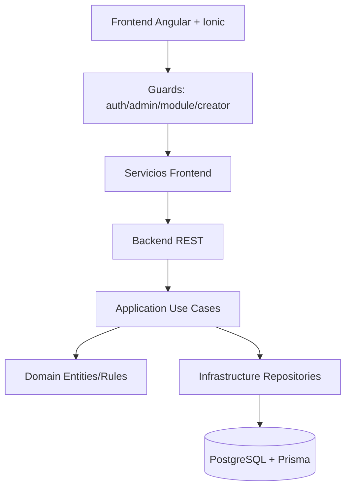

### D.2 Matriz de acceso por rol (alto nivel)

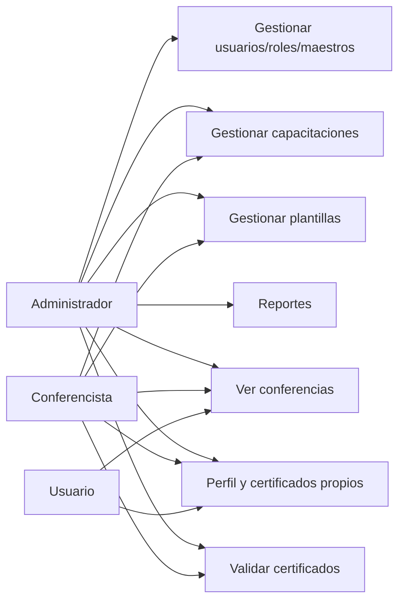

### D.3 Flujo de autenticación y autorización

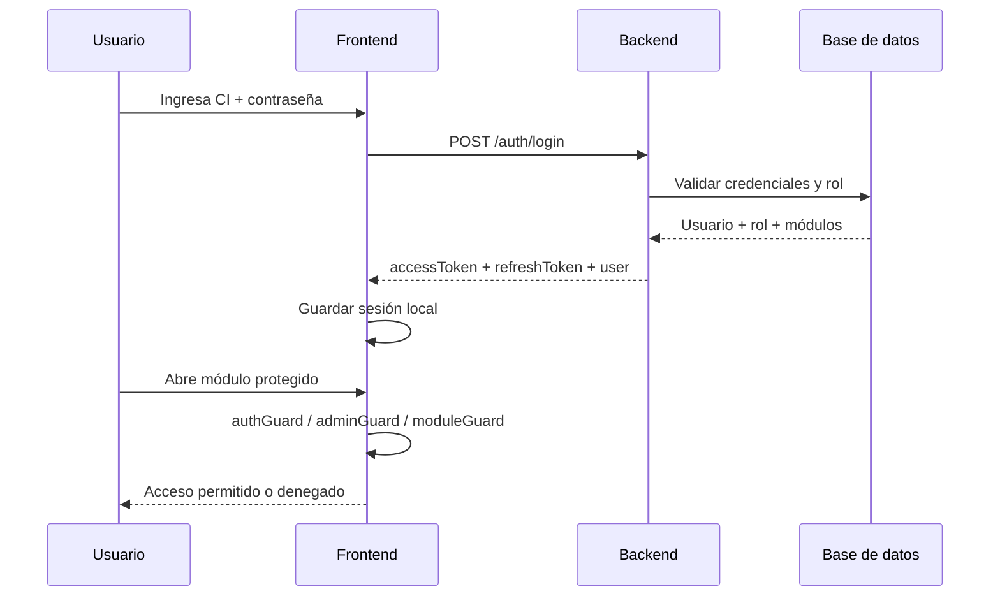

### D.4 Flujo de inscripción y asistencia QR

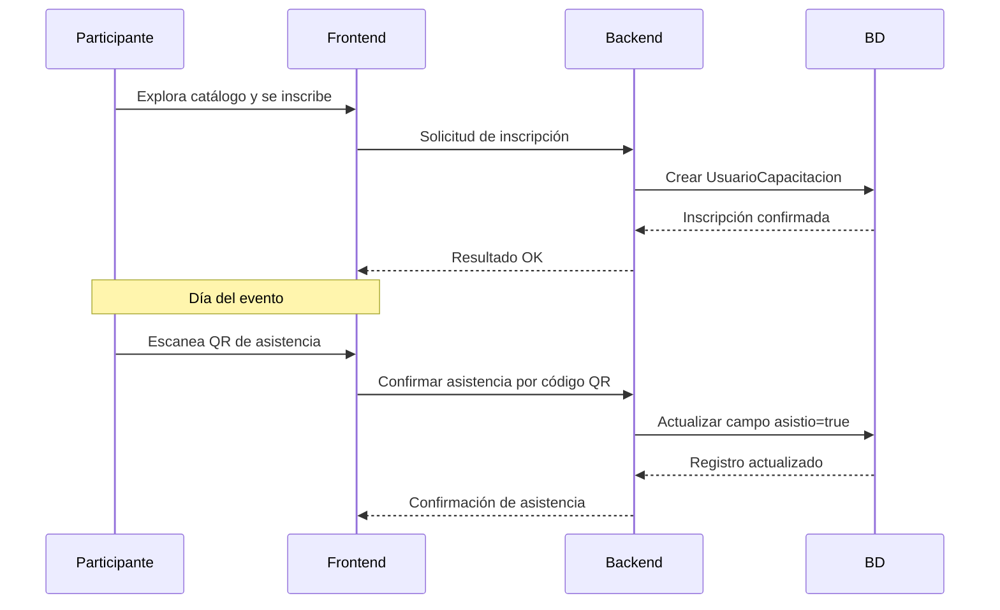

### D.5 Flujo de emisión y validación de certificados

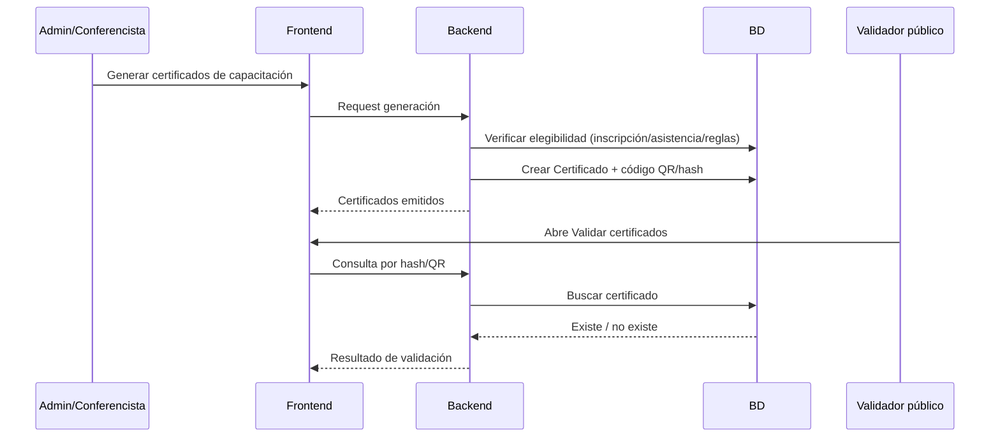

### D.6 Diagrama ER simplificado (núcleo de negocio)

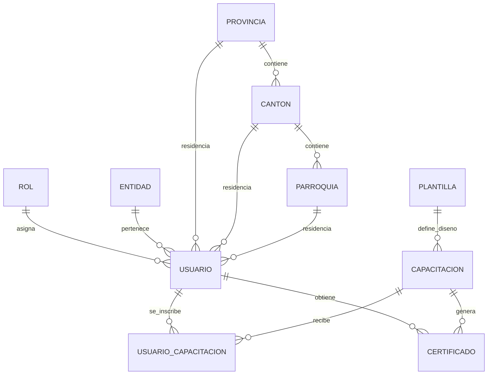

### D.7 Diagrama de despliegue operativo

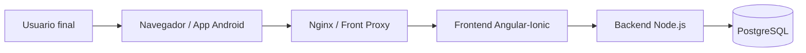

---

## Anexo E — Catálogo de módulos operativos (nomenclatura funcional)

Los textos siguientes corresponden a módulos que aparecen en roles y navegación (pueden variar por configuración):

- Ver Perfil
- Ver conferencias
- Validar certificados
- Gestionar roles
- Gestionar usuarios
- Gestionar entidades
- Gestionar provincias
- Gestionar cantones
- Gestionar parroquias
- Gestionar competencias
- Gestionar instituciones
- Gestionar cargos
- Gestionar grados ocupacionales
- Gestionar capacitaciones
- Gestionar plantillas
- Gestionar reportes

---

## Anexo F — Matriz de trazabilidad funcional (auditable)

Esta matriz conecta cada macrofunción con su evidencia en interfaz, seguridad, backend y datos.

### F.1 Seguridad, sesión y acceso

| Macrofunción | Frontend (ruta/pantalla) | Guard/Control | Backend (área) | Datos principales |
|--------------|---------------------------|---------------|----------------|-------------------|
| Iniciar sesión | `/login` | Validación de formulario y estado de sesión | `application/auth/*` | `Usuario`, `Rol` |
| Registro de cuenta | `/register` | Validaciones de entrada | `application/auth/*`, `application/user/*` | `Usuario` |
| Recuperar contraseña | `/recuperar-password` | Flujo de recuperación | `application/auth/reset-password*` | `Usuario` |
| Cerrar sesión | menú/header global | Limpieza de tokens locales | `auth/logout` (si aplica en API) | sesión local |
| Renovación sesión | transparente en cliente | token/refresh token | `auth/refresh` | tokens |
| Protección de rutas autenticadas | `/ver-perfil`, `/ver-conferencias`, etc. | `authGuard` | validación JWT | `Usuario` |
| Protección admin | `/gestionar-*` | `adminGuard` + `moduleGuard` | autorización por rol/módulo | `Rol.modulos` |
| Protección conferencista | `/conferencista/*` | `creatorGuard` | autorización por rol | `Rol` |

### F.2 Perfil y usuario

| Macrofunción | Frontend (ruta/pantalla) | Guard/Control | Backend (área) | Tablas |
|--------------|---------------------------|---------------|----------------|--------|
| Ver perfil | `/ver-perfil` | `authGuard` | `application/user/get-my-profile*` | `usuarios` |
| Editar perfil | `/ver-perfil/editar` | `authGuard` | `application/user/update*` | `usuarios` |
| Firma de usuario | `/ver-perfil/firma` | `authGuard` | `user controller/services` | `usuarios.firma_url` |
| Logros/historial | `/ver-perfil/logros` | `authGuard` | consultas de historial | `usuarios_capacitaciones`, `certificados` |
| Gestión de usuarios (admin) | `/gestionar-usuarios/*` | `adminGuard` + módulo | `application/user/*` | `usuarios`, `roles`, `entidades` |

### F.3 Roles y permisos

| Macrofunción | Frontend | Guard/Control | Backend | Tablas |
|--------------|----------|---------------|---------|--------|
| CRUD roles | `/gestionar-roles/*` | `adminGuard` + módulo | `application/user/get-all-roles*` y CRUD de rol | `roles` |
| Asignación de módulos | formulario de rol | `moduleGuard` en consumo | validación de permisos por rol | `roles.modulos` |
| Navegación por módulo | menú lateral/header | mapeo módulo→ruta | coherencia con permisos de API | `roles` |

### F.4 Maestros territoriales e institucionales

| Macrofunción | Frontend | Guard/Control | Backend | Tablas |
|--------------|----------|---------------|---------|--------|
| Provincias | `/gestionar-provincias/*` | admin + módulo | `application/provincia/*` | `provincias` |
| Cantones | `/gestionar-cantones/*` | admin + módulo | `application/canton/*` | `cantones` |
| Parroquias | `/gestionar-parroquias/*` | admin + módulo | `application/parroquia/*` | `parroquias` |
| Entidades | `/gestionar-entidades/*` | admin + módulo | `application/entidad/*` | `entidades` |
| Instituciones | `/gestionar-instituciones/*` | admin + módulo | `application/institucion/*` | `instituciones_sistema`, `tipo_institucion` |
| Cargos | `/gestionar-cargos-instituciones/*` | admin (+módulo en menú) | `application/cargo/*` | `cargos` |
| Grados ocupacionales | `/gestionar-grados` | admin + módulo | `application/grado-ocupacional/*` | `grados_ocupacionales` |
| Competencias | `/gestionar-competencias/*` | admin + módulo | `application/competencia/*` | `competencias` |

### F.5 Ciclo de capacitación (núcleo)

| Macrofunción | Frontend | Guard/Control | Backend | Tablas |
|--------------|----------|---------------|---------|--------|
| Crear capacitación | `/gestionar-capacitaciones/crear` y `/conferencista/.../crear` | admin o creator | `application/capacitacion/create*` | `capacitaciones` |
| Editar capacitación | `/gestionar-capacitaciones/editar/:id` | admin o creator | `application/capacitacion/update*` | `capacitaciones` |
| Listar capacitaciones | listados admin/user/public | por rol/contexto | `application/capacitacion/get*` | `capacitaciones` |
| Ver inscritos por evento | `.../visualizar-inscritos/:id` | admin o creator | `application/usuario-capacitacion/get*` | `usuarios_capacitaciones` |
| Agregar/quitar inscritos | modal de inscritos | admin o creator | `application/usuario-capacitacion/*` | `usuarios_capacitaciones` |
| Marcar asistencia | pantalla de inscritos y QR participante | reglas de estado | `actualizar-asistencia`, `confirmar-asistencia-qr` | `usuarios_capacitaciones.asistio` |
| Rol dentro del evento | pantalla de inscritos | validación enum | `rol_capacitacion` use-cases | `usuarios_capacitaciones.rol_capacitacion` |

### F.6 Certificación y validación

| Macrofunción | Frontend | Guard/Control | Backend | Tablas |
|--------------|----------|---------------|---------|--------|
| Generar certificados | `/certificados/:id` y flujos de evento | admin/creator | `generate-certificado`, `generate-all-certificados` | `certificados` |
| Consultar certificados propios | `/mis-certificados` | `authGuard` | endpoint `certificados/my` | `certificados` |
| Validar certificado público | `/validar-certificados` | público | `get-certificado-by-qr` | `certificados`, `capacitaciones`, `usuarios` |
| Descargar/exportar PDF | vistas de certificado/reportes | control por sesión | generación PDF backend/frontend | `certificados.pdf_url` |

### F.7 Plantillas y reportes

| Macrofunción | Frontend | Guard/Control | Backend | Tablas |
|--------------|----------|---------------|---------|--------|
| CRUD plantillas | `/gestionar-plantillas/*`, `/conferencista/gestionar-plantillas/*` | admin/creator | `application/plantilla/*` | `plantillas` |
| Asociar plantilla a capacitación | crear/editar capacitación | reglas de formulario | casos de uso de capacitación | `capacitaciones.id_plantilla` |
| Dashboard de reportes | `/gestionar-reportes` | admin + módulo | `application/reportes/*` | agregados sobre `usuarios`, `capacitaciones`, `certificados`, `usuarios_capacitaciones` |
| Exportar PDF de dashboard | botón exportar en reportes | admin + módulo | `exportar-pdf.use-case` | dataset agregado |

### F.8 Catálogos extendidos y operación de datos

| Proceso | Evidencia funcional | Capa técnica | Datos impactados |
|---------|---------------------|--------------|------------------|
| Seed inicial del sistema | disponibilidad de roles, usuarios y catálogos | `backend/prisma/seed.ts` | múltiples tablas maestras y transaccionales |
| Catálogos GAD parroquias | selección/normalización geográfica | scripts prisma/tools + seed reference | `gad_parroquias` |
| Catálogos educación básica | vinculación institucional usuario | seed reference | `educacion_basica`, `instituciones_usuario` |
| Sincronización género/etnia | consistencia de opciones de perfil | seed sync | `generos`, `etnias` |

### F.9 Matriz rápida ruta → guard → módulo esperado

| Ruta | Guard | Módulo esperado (si aplica) |
|------|-------|-----------------------------|
| `/gestionar-reportes` | `adminGuard` + `moduleGuard` | `Gestionar reportes` |
| `/gestionar-usuarios` | `adminGuard` + `moduleGuard` | `Gestionar usuarios` |
| `/gestionar-roles` | `adminGuard` + `moduleGuard` | `Gestionar roles` |
| `/gestionar-capacitaciones` | `adminGuard` + `moduleGuard` | `Gestionar capacitaciones` |
| `/gestionar-entidades` | `adminGuard` + `moduleGuard` | `Gestionar entidades` |
| `/gestionar-provincias` | `adminGuard` + `moduleGuard` | `Gestionar provincias` |
| `/gestionar-cantones` | `adminGuard` + `moduleGuard` | `Gestionar cantones` |
| `/gestionar-parroquias` | `adminGuard` + `moduleGuard` | `Gestionar parroquias` |
| `/gestionar-competencias` | `adminGuard` + `moduleGuard` | `Gestionar competencias` |
| `/gestionar-instituciones` | `adminGuard` + `moduleGuard` | `Gestionar instituciones` |
| `/gestionar-cargos-instituciones` | `adminGuard` (+módulo vía navegación) | `Gestionar cargos` |
| `/gestionar-grados` | `adminGuard` + `moduleGuard` | `Gestionar grados ocupacionales` |
| `/gestionar-plantillas` | `adminGuard` + `moduleGuard` | `Gestionar plantillas` |
| `/conferencista/gestionar-capacitaciones` | `creatorGuard` | rol Conferencista/Administrador |
| `/conferencista/gestionar-plantillas` | `creatorGuard` | rol Conferencista/Administrador |
| `/ver-perfil` | `authGuard` | N/A |
| `/ver-conferencias` | `authGuard` | N/A |
| `/mis-certificados` | `authGuard` | N/A |
| `/confirmar-asistencia` | `authGuard` | N/A |

### F.10 Checklist de auditoría funcional (UAT)

- [ ] Un usuario invitado puede navegar todo el front público sin autenticación.
- [ ] Un usuario autenticado sin rol admin no accede a `/gestionar-*`.
- [ ] Un admin con módulo faltante recibe denegación por `moduleGuard`.
- [ ] Un conferencista accede a `/conferencista/*` y no a CRUD de maestros sensibles.
- [ ] El flujo inscripción → asistencia → certificado se completa sin inconsistencias.
- [ ] El certificado emitido se valida públicamente por QR/hash.
- [ ] Reportes responden a filtros y exportan PDF.
- [ ] Catálogos clave (territorio/instituciones/competencias) mantienen integridad relacional.

---

## Anexo G — Diagramas y visuales avanzados

### G.1 Diagrama de estados de capacitación (referencia operativa)

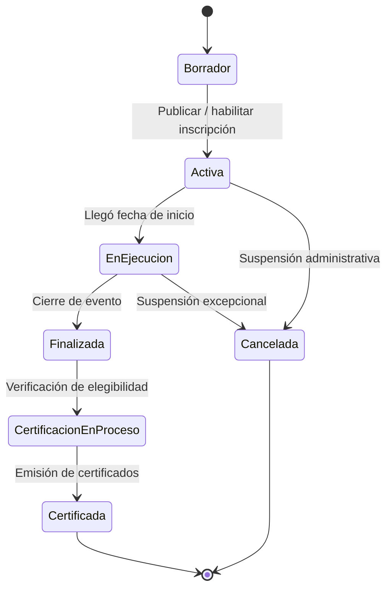

> Nota: los nombres de estado de UI pueden variar por configuración; este diagrama representa el ciclo de vida recomendado para control operativo y auditoría.

### G.2 Journey operativo por rol (timeline)

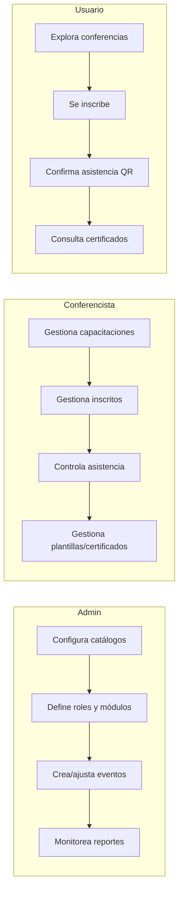

### G.3 Árbol de navegación global

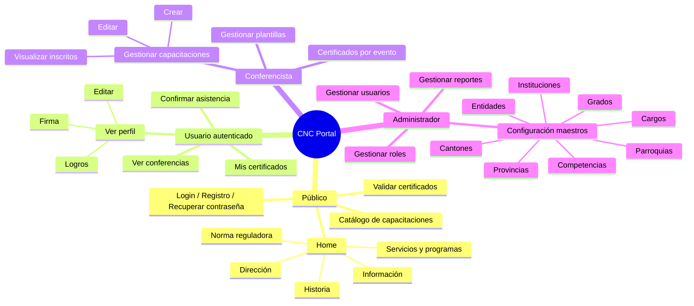

### G.4 RACI funcional (responsabilidad por proceso)

RACI: **R** Responsible (ejecuta), **A** Accountable (aprueba), **C** Consulted (consulta), **I** Informed (informado).

| Proceso | Administrador | Conferencista | Usuario/Participante | Soporte TI |
|---------|---------------|---------------|----------------------|------------|
| Alta de catálogos maestros | A/R | I | I | C |
| Alta/edición de roles y módulos | A/R | I | I | C |
| Alta/edición de capacitación | A | R | I | C |
| Gestión de inscritos y asistencia | A | R | C/R (su propia asistencia) | I |
| Generación de certificados | A | R | I | C |
| Validación pública de certificados | I | I | R | I |
| Consumo de certificados personales | I | I | R | I |
| Monitoreo de reportes | A/R | C | I | C |
| Incidencias técnicas y continuidad | A | I | I | R |

### G.5 Mapa visual de dependencias entre dominios

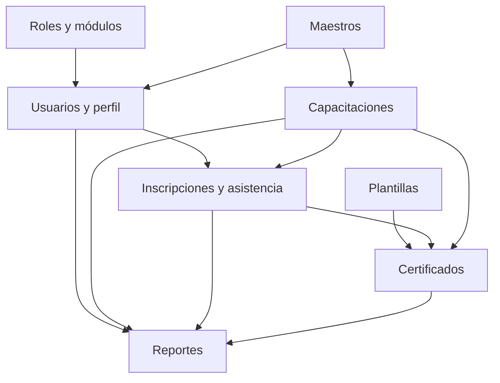

### G.6 Plantilla para capturas de pantalla (sección lista para completar)

> Recomendación: guarde capturas en `docs/img/manual/` y use nombres estables.

#### G.6.1 Portada y acceso

#### G.6.2 Usuario

#### G.6.3 Conferencista

#### G.6.4 Administrador

#### G.6.5 Validación y certificados

---

*Fin del manual de usuario.*
