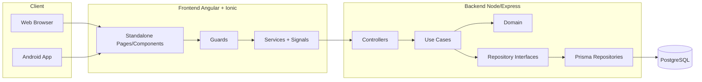
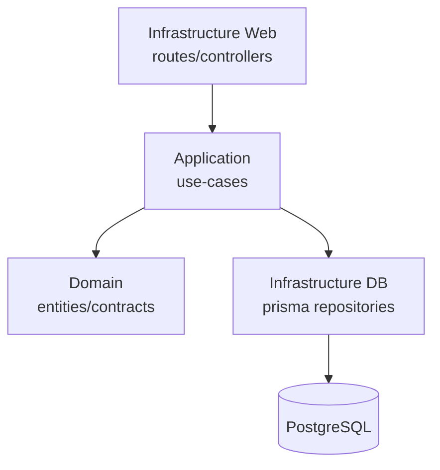
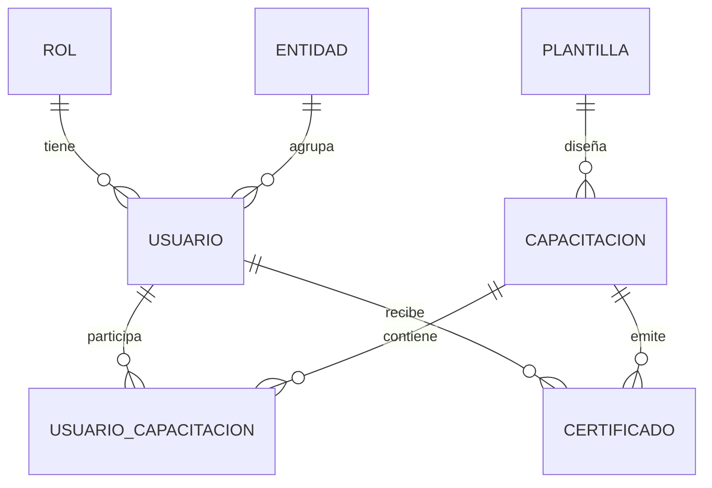
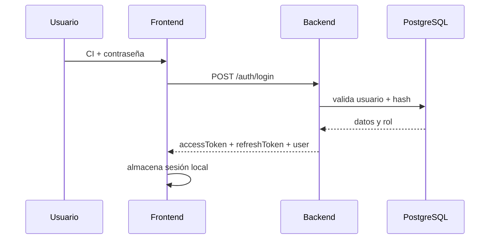
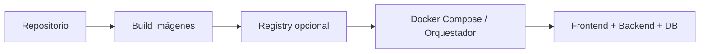

# Manual Técnico — CnCApp (CNC Portal)

**Sistema:** Gestión de capacitaciones y certificaciones CNC  
**Proyecto:** `CnCApp`  
**Versión del documento:** 1.0 (marzo 2026)  
**Audiencia:** Arquitectura, desarrollo backend/frontend, QA, DevOps, soporte técnico, administradores de plataforma.

---

## Tabla de contenidos

1. [Propósito y alcance](#1-propósito-y-alcance)
2. [Visión de arquitectura](#2-visión-de-arquitectura)
3. [Estructura del repositorio](#3-estructura-del-repositorio)
4. [Stack tecnológico](#4-stack-tecnológico)
5. [Arquitectura backend (Clean Architecture)](#5-arquitectura-backend-clean-architecture)
6. [Arquitectura frontend (Angular + Ionic)](#6-arquitectura-frontend-angular--ionic)
7. [Modelo de datos y Prisma](#7-modelo-de-datos-y-prisma)
8. [Autenticación, autorización y sesión](#8-autenticación-autorización-y-sesión)
9. [Módulos funcionales y trazabilidad técnica](#9-módulos-funcionales-y-trazabilidad-técnica)
10. [Generación de certificados y validación QR](#10-generación-de-certificados-y-validación-qr)
11. [Reportes y exportaciones](#11-reportes-y-exportaciones)
12. [Configuración por entorno](#12-configuración-por-entorno)
13. [Ejecución local](#13-ejecución-local)
14. [Docker y despliegue](#14-docker-y-despliegue)
15. [Aplicación móvil Android (Capacitor)](#15-aplicación-móvil-android-capacitor)
16. [Calidad, pruebas y linting](#16-calidad-pruebas-y-linting)
17. [Observabilidad y logging](#17-observabilidad-y-logging)
18. [Seguridad técnica](#18-seguridad-técnica)
19. [Runbooks operativos](#19-runbooks-operativos)
20. [Troubleshooting técnico](#20-troubleshooting-técnico)
21. [Mantenimiento y evolución](#21-mantenimiento-y-evolución)
22. [Anexos técnicos](#22-anexos-técnicos)

---

## 1. Propósito y alcance

Este documento describe técnicamente el sistema `CnCApp`, desde su arquitectura y diseño hasta su operación en ambientes de desarrollo y producción.

Objetivos:

- Servir como referencia única para equipos técnicos.
- Reducir curva de onboarding.
- Estandarizar despliegue, soporte y evolución.
- Facilitar auditoría técnica y continuidad operativa.

No cubre manual de usuario final (ver `MANUAL_DE_USUARIO.md`).

---

## 2. Visión de arquitectura



Principios aplicados:

- Separación de responsabilidades por capas.
- Dominio desacoplado de infraestructura.
- Repositorios para acceso a persistencia.
- Frontend con rutas protegidas por guardas.
- Catálogos y roles administrables desde sistema.

---

## 3. Estructura del repositorio

```text
CnCApp/
├── backend/
│   ├── prisma/                  # schema, migraciones, seeds, utilidades de catálogo
│   ├── src/
│   │   ├── application/         # casos de uso por módulo
│   │   ├── domain/              # entidades, reglas, contratos de repositorio
│   │   ├── infrastructure/
│   │   │   ├── database/        # repositorios Prisma
│   │   │   └── web/             # controllers, routes, middlewares
│   │   ├── config/              # configuración de runtime
│   │   ├── scripts/             # scripts operativos
│   │   └── services/            # servicios transversales
│   └── ...
├── frontend/
│   ├── src/app/
│   │   ├── core/                # guards, interceptors, servicios base
│   │   ├── shared/              # componentes y utilidades comunes
│   │   ├── features/            # módulos funcionales (auth/public/admin/user/creator)
│   │   └── app.routes.ts        # composición de rutas
│   └── ...
├── android/                     # proyecto android nativo (capacitor)
├── docs/                        # documentación técnica complementaria
├── MANUAL_DE_USUARIO.md
└── MANUAL_TECNICO.md
```

---

## 4. Stack tecnológico

### 4.1 Backend

- Node.js 18+
- TypeScript
- Express
- Prisma ORM
- PostgreSQL
- JWT
- bcrypt

### 4.2 Frontend

- Angular 19 (standalone)
- Ionic 8
- Signals (estado reactivo)
- RxJS
- Capacitor 7

### 4.3 Plataforma/DevOps

- Docker / Docker Compose
- Nginx (según despliegue)
- npm scripts

---

## 5. Arquitectura backend (Clean Architecture)

### 5.1 Capas



### 5.2 `domain/`

Contiene:

- Entidades de negocio.
- Contratos de repositorios.
- Utilidades puras de validación (ej. cédula).

Regla: esta capa no debe depender de Express, Prisma ni detalles de transporte.

### 5.3 `application/`

Organización por módulo (`auth`, `user`, `capacitacion`, `certificado`, `reportes`, etc.).  
Cada caso de uso:

- Recibe DTO/input.
- Aplica reglas de negocio.
- Orquesta repositorios y servicios.
- Devuelve salida de aplicación.

### 5.4 `infrastructure/database/`

Implementa contratos con Prisma:

- Traducción de modelos de dominio a tablas.
- Consultas optimizadas.
- Manejo de relaciones y filtros.

### 5.5 `infrastructure/web/`

- Rutas por módulo.
- Controllers delgados.
- Validación básica de request.
- Mapeo de errores a respuestas HTTP.

Patrón recomendado:

1. Controller extrae params/body/contexto.
2. Invoca use-case.
3. Retorna `success/data/message` consistente.

---

## 6. Arquitectura frontend (Angular + Ionic)

### 6.1 Enrutamiento

`app.routes.ts` agrega rutas de:

- `public`
- `auth`
- `admin`
- `user`
- `creator` (conferencista)

### 6.2 Guards

- `authGuard`: exige sesión.
- `adminGuard`: exige rol administrador.
- `moduleGuard`: exige módulo requerido (`route.data.requiredModule`).
- `creatorGuard`: permite conferencista/administrador.

### 6.3 Estado de autenticación

Servicio `AuthService` con señales:

- `currentUser`
- `isAuthenticated`
- `accessToken`
- `refreshToken`

Computed:

- `userName`
- `roleName`
- `modulos`

### 6.4 Convenciones de capa UI

- `features/*` por dominio funcional.
- Componentes standalone.
- Servicios por feature.
- Uso de `ChangeDetectionStrategy.OnPush` en pantallas críticas.

---

## 7. Modelo de datos y Prisma

### 7.1 Núcleo del modelo

Entidades centrales:

- `Usuario`, `Rol`, `Entidad`
- `Capacitacion`, `UsuarioCapacitacion`, `Certificado`, `Plantilla`
- `Provincia`, `Canton`, `Parroquia`, `GadParroquia`
- `InstitucionSistema`, `InstitucionUsuario`, `TipoInstitucion`
- `Competencia`, `FuncionarioGAD`, `Autoridad`
- `Genero`, `Etnia`, `Nacionalidad`, `TipoParticipante`

### 7.2 Relaciones críticas



### 7.3 Índices y unicidad (ejemplos relevantes)

- `Usuario.ci` único.
- `UsuarioCapacitacion` único compuesto `(usuarioId, capacitacionId)`.
- `Certificado.codigoQR` único.
- Índices por FK para filtros/reportes.

### 7.4 Migraciones

Buenas prácticas:

- Cada cambio en `schema.prisma` debe ir acompañado de migración.
- Probar migración en entorno local limpio.
- No editar migraciones ya aplicadas en producción.

### 7.5 Seed y catálogos

`backend/prisma/seed.ts` carga:

- Roles base y módulos.
- Catálogos territoriales e institucionales.
- Datos de referencia de prueba.

Scripts auxiliares en `prisma/tools/` y `prisma/data/` soportan ingestas específicas.

---

## 8. Autenticación, autorización y sesión

### 8.1 Flujo



### 8.2 Autorización por módulos

- El rol posee `modulos` (JSON/array).
- Frontend evalúa acceso con `moduleGuard`.
- Backend debe validar también permisos en endpoints sensibles (defensa en profundidad).

### 8.3 Seguridad de credenciales

- Contraseñas hasheadas con `bcrypt`.
- Tokens firmados con secreto de entorno.
- No exponer secretos en repositorio.

---

## 9. Módulos funcionales y trazabilidad técnica

### 9.1 Mapa general

| Módulo | Frontend | Backend | Datos |
|--------|----------|---------|-------|
| Auth | `features/auth` | `application/auth` | `usuarios`, `roles` |
| Usuarios | `features/admin/users`, `features/user/perfil` | `application/user` | `usuarios` |
| Capacitaciones | `features/admin/capacitaciones` | `application/capacitacion` | `capacitaciones` |
| Inscripciones | `visualizarinscritos`, conferencias | `application/usuario-capacitacion` | `usuarios_capacitaciones` |
| Certificados | `features/admin/certificados`, `features/user/certificados`, `public/validar-qr` | `application/certificado` | `certificados` |
| Plantillas | `features/admin/plantillas` | `application/plantilla` | `plantillas` |
| Reportes | `features/admin/reportes` | `application/reportes` | agregados |

### 9.2 Rutas críticas

- Público: `/home/*`, `/catalogo-capacitaciones`, `/validar-certificados`
- Auth: `/login`, `/register`, `/recuperar-password`
- Usuario: `/ver-perfil`, `/ver-conferencias`, `/mis-certificados`, `/confirmar-asistencia`
- Admin: `/gestionar-*`, `/configuracion-maestros`, `/certificados/:id`
- Conferencista: `/conferencista/*`

---

## 10. Generación de certificados y validación QR

### 10.1 Emisión

Casos de uso de certificados:

- Generación individual por participante.
- Generación masiva por evento.
- Consulta por hash/QR.

Consideraciones:

- `codigoQR` único.
- Integración con plantilla y datos del evento.
- Registro de metadatos de emisión (`fechaEmision`, `pdfUrl`).

### 10.2 Validación

Pantalla pública `validar-qr`:

- Escaneo con `html5-qrcode`.
- Entrada por parámetro `hash`.
- Respuesta válida/no válida.

### 10.3 Riesgos comunes

- QR inválido por hash truncado.
- Cámara sin permisos.
- Certificados huérfanos si se alteran claves foráneas sin control.

---

## 11. Reportes y exportaciones

### 11.1 Dashboard

Incluye:

- KPIs de usuarios, capacitaciones y certificados.
- Tendencias.
- Filtros por rango de fechas, entidad, modalidad.

### 11.2 Exportación PDF

Use-case dedicado (`exportar-pdf`) expuesto al frontend.

Recomendaciones:

- Limitar tamaño de dataset por filtros.
- Añadir timeout razonable.
- Loggear errores de generación para soporte.

---

## 12. Configuración por entorno

### 12.1 Variables backend (conceptual)

- `DATABASE_URL`
- `JWT_SECRET`
- `PORT`
- CORS allowlist
- Flags de entorno (`NODE_ENV`)

### 12.2 Variables frontend

- `environment.ts` / `environment.prod.ts`
- `apiUrl`

Regla:

- Nunca hardcodear URLs/secretos en componentes.
- Centralizar configuración en `environments`.

---

## 13. Ejecución local

### 13.1 Desde raíz

```bash
npm run install:all
npm run dev:backend
npm run dev:frontend
```

### 13.2 Backend (manual)

```bash
cd backend
npm install
npm run prisma:migrate
npm run prisma:seed
npm run dev
```

### 13.3 Frontend (manual)

```bash
cd frontend
npm install
npm start
```

---

## 14. Docker y despliegue

### 14.1 Flujo estándar



### 14.2 Recomendaciones

- Separar redes internas para backend/db.
- No exponer PostgreSQL públicamente.
- Backup periódico de base de datos.
- Healthchecks de servicios.

---

## 15. Aplicación móvil Android (Capacitor)

### 15.1 Pipeline

1. Build frontend.
2. `npx cap sync android`.
3. Abrir Android Studio.
4. Generar APK/AAB.

### 15.2 Consideraciones

- Permisos de cámara para QR.
- Pruebas en dispositivos reales.
- Validar deep links si se usan.

---

## 16. Calidad, pruebas y linting

### 16.1 Tipos de pruebas recomendadas

- Unitarias: utilidades, guards, servicios.
- Integración backend: controller + use-case + repositorio.
- E2E funcional: login, inscripción, asistencia, certificación, validación QR.

### 16.2 Casos críticos mínimos

- Login exitoso/fallido.
- Denegación por rol y por módulo.
- Crear capacitación + inscripción + asistencia.
- Generar certificado + validar QR.
- Exportar reporte PDF.

### 16.3 Lint y formateo

- ESLint backend/frontend.
- Estilo consistente TypeScript.
- Revisar warnings antes de merge.

---

## 17. Observabilidad y logging

### 17.1 Lineamientos

- Logs por request en backend (método, ruta, status, tiempo).
- Logs de errores con contexto (sin secretos).
- Identificador de correlación para trazabilidad.

### 17.2 Qué no loggear

- Contraseñas.
- Tokens completos.
- Datos personales sensibles en texto plano.

---

## 18. Seguridad técnica

### 18.1 Controles recomendados

- Hash fuerte de contraseñas.
- JWT con expiración corta + refresh token.
- CORS restrictivo.
- Rate limiting en auth.
- Sanitización/validación de input.
- Gestión segura de archivos (si aplica para firmas/fotos).

### 18.2 Riesgos a monitorear

- Escalación de privilegios por mala configuración de módulos.
- Inyección por consultas dinámicas no parametrizadas.
- Exposición accidental de `.env`.
- Dependencias vulnerables desactualizadas.

---

## 19. Runbooks operativos

### 19.1 Alta de nuevo entorno

1. Provisionar DB PostgreSQL.
2. Configurar variables seguras.
3. Ejecutar migraciones.
4. Ejecutar seed inicial (si aplica).
5. Levantar frontend/backend.
6. Pruebas smoke.

### 19.2 Rotación de secreto JWT

1. Generar nuevo secreto.
2. Aplicar en entorno.
3. Reiniciar backend.
4. Forzar relogin de sesiones.

### 19.3 Recuperación por caída

1. Validar estado de contenedores/procesos.
2. Revisar conectividad a DB.
3. Restaurar desde backup si hay corrupción.
4. Ejecutar smoke tests funcionales.

---

## 20. Troubleshooting técnico

| Síntoma | Causa probable | Acción |
|--------|-----------------|--------|
| 401 en rutas protegidas | Token ausente/expirado | Renovar sesión; revisar refresh |
| 403 acceso denegado | Rol/módulo insuficiente | Revisar `roles.modulos` y guards |
| Error Prisma P2021 | tabla no existe | Revisar migraciones aplicadas |
| QR no escanea | permisos/cámara | habilitar permisos; usar entrada manual |
| Reporte PDF falla | dataset grande/timeout | aplicar filtros; revisar logs backend |
| Front no conecta API | `apiUrl` incorrecta | validar `environment.*` |

---

## 21. Mantenimiento y evolución

### 21.1 Política recomendada de cambios

- Todo cambio funcional debe incluir:
  - actualización de rutas/guards (si aplica),
  - ajuste de use-cases/repositorios,
  - migración de BD cuando corresponda,
  - prueba funcional mínima.

### 21.2 Estrategia de versionado

- Versionado semántico por release.
- Changelog técnico por sprint.
- ADRs para decisiones de arquitectura relevantes.

### 21.3 Deuda técnica prioritaria (guía)

- Homologar nombres de roles entre UI, seed y documentación.
- Endurecer autorización backend por módulo en endpoints críticos.
- Estandarizar formato de respuestas y errores en toda API.
- Fortalecer suite E2E para ciclo completo de certificación.

---

## 22. Anexos técnicos

### 22.1 Matriz API (alto nivel)

| Dominio | Endpoint esperado (referencial) | Método |
|---------|----------------------------------|--------|
| Auth | `/auth/login`, `/auth/refresh`, `/auth/reset-password` | POST |
| Users | `/users`, `/users/:id`, `/users/profile` | GET/POST/PUT/DELETE |
| Roles | `/roles`, `/roles/:id` | GET/POST/PUT/DELETE |
| Capacitaciones | `/capacitaciones`, `/capacitaciones/:id` | GET/POST/PUT/DELETE |
| Inscripciones | `/capacitaciones/:id/inscritos`, `/inscripciones/*` | GET/POST/PUT/DELETE |
| Certificados | `/certificados/*`, `/certificados/my` | GET/POST |
| Validación | `/certificados/validate` | GET/POST |
| Reportes | `/reportes/dashboard`, `/reportes/export/pdf` | GET/POST |

> Nota: los paths exactos pueden variar según el router implementado; usar este cuadro como mapa de referencia.

### 22.2 Checklist de release técnico

- [ ] Migraciones ejecutadas sin error.
- [ ] Seed y catálogos validados (si aplica).
- [ ] Variables de entorno completas.
- [ ] Build backend/frontend exitoso.
- [ ] Smoke test de login, módulos y certificación.
- [ ] Validación pública QR operativa.
- [ ] Dashboard y exportación PDF operativos.
- [ ] Backups y monitoreo activos.

### 22.3 Checklist de auditoría de seguridad

- [ ] No hay secretos en git.
- [ ] CORS restringido a dominios autorizados.
- [ ] Contraseñas hasheadas y política de rotación definida.
- [ ] Token refresh implementado y validado.
- [ ] Accesos admin protegidos por doble control (rol+módulo).
- [ ] Dependencias revisadas con escaneo de vulnerabilidades.

---

## Cierre

Este manual técnico debe mantenerse versionado junto al código y actualizarse en cada cambio de arquitectura, seguridad, modelo de datos o despliegue.

**Documento relacionado:** `MANUAL_DE_USUARIO.md`  
**Documentación complementaria:** carpeta `docs/`

