# Manual Técnico — CnCApp (CNC Portal)

**Sistema:** Gestión de capacitaciones y certificaciones CNC  
**Proyecto:** `CnCApp`  
**Desarrollador:** Jorge Doicela  
**Versión del documento:** 1.3 (marzo 2026)  
**Audiencia:** Arquitectura, desarrollo backend/frontend, QA, DevOps, soporte técnico, administradores de plataforma.

---

## Control documental

### Identificación

| Campo | Valor |
|------|-------|
| Documento | Manual Técnico — CnCApp |
| Código interno sugerido | `CNC-TEC-MANUAL-001` |
| Desarrollador | Jorge Doicela |
| Clasificación | Uso interno técnico |
| Estado | Vigente |
| Versión actual | 1.3 |
| Fecha de vigencia | 2026-03-24 |

### Historial de cambios

| Versión | Fecha | Autor | Cambios principales |
|---------|-------|-------|---------------------|
| 1.0 | 2026-03-24 | Equipo técnico | Emisión inicial del manual técnico integral. |
| 1.1 | 2026-03-24 | Equipo técnico | Se agrega formato audit-ready: control documental, responsables por sección y matriz de cumplimiento (ISO 27001 / ENS básico / OWASP ASVS). |
| 1.2 | 2026-03-24 | Equipo técnico | Revisión de profesionalización: arquitectura C4, NFR/SLO, contratos API, secuencias E2E, CI/CD, gobierno técnico y modelo de datos extendido. |
| 1.3 | 2026-03-24 | Equipo técnico | Se agrega matriz de riesgos técnicos y modelo de amenazas STRIDE para autenticación y certificación QR. |

### Aprobaciones (plantilla)

| Rol | Nombre | Firma/VoBo | Fecha |
|-----|--------|------------|-------|
| Propietario funcional | Pendiente | Pendiente | Pendiente |
| Líder técnico | Pendiente | Pendiente | Pendiente |
| Seguridad de la información | Pendiente | Pendiente | Pendiente |
| Operaciones/DevOps | Pendiente | Pendiente | Pendiente |

---

## Tabla de contenidos

1. [Propósito y alcance](#1-propósito-y-alcance)
2. [Visión de arquitectura](#2-visión-de-arquitectura)
3. [Estructura del repositorio](#3-estructura-del-repositorio)
4. [Stack tecnológico](#4-stack-tecnológico)
5. [Arquitectura backend (Clean Architecture)](#5-arquitectura-backend-clean-architecture)
6. [Arquitectura frontend (Angular + Ionic)](#6-arquitectura-frontend-angular--ionic)
7. [Modelo de datos y Prisma](#7-modelo-de-datos-y-prisma)
8. [Autenticación, autorización y sesión](#8-autenticación-autorización-y-sesión)
9. [Módulos funcionales y trazabilidad técnica](#9-módulos-funcionales-y-trazabilidad-técnica)
10. [Generación de certificados y validación QR](#10-generación-de-certificados-y-validación-qr)
11. [Reportes y exportaciones](#11-reportes-y-exportaciones)
12. [Configuración por entorno](#12-configuración-por-entorno)
13. [Ejecución local](#13-ejecución-local)
14. [Docker y despliegue](#14-docker-y-despliegue)
15. [Aplicación móvil Android (Capacitor)](#15-aplicación-móvil-android-capacitor)
16. [Calidad, pruebas y linting](#16-calidad-pruebas-y-linting)
17. [Observabilidad y logging](#17-observabilidad-y-logging)
18. [Seguridad técnica](#18-seguridad-técnica)
19. [Runbooks operativos](#19-runbooks-operativos)
20. [Troubleshooting técnico](#20-troubleshooting-técnico)
21. [Mantenimiento y evolución](#21-mantenimiento-y-evolución)
22. [Anexos técnicos](#22-anexos-técnicos)
23. [Responsables por sección (RACI documental)](#23-responsables-por-sección-raci-documental)
24. [Matriz de cumplimiento normativo](#24-matriz-de-cumplimiento-normativo)
25. [Plan de evidencias de auditoría](#25-plan-de-evidencias-de-auditoría)
26. [Arquitectura C4 (detalle profesional)](#26-arquitectura-c4-detalle-profesional)
27. [Requisitos no funcionales y SLO](#27-requisitos-no-funcionales-y-slo)
28. [Contratos técnicos de API](#28-contratos-técnicos-de-api)
29. [Flujos E2E críticos](#29-flujos-e2e-críticos)
30. [CI/CD y estrategia de releases](#30-cicd-y-estrategia-de-releases)
31. [Gobierno de arquitectura y estándares](#31-gobierno-de-arquitectura-y-estándares)
32. [Matriz de riesgos técnicos](#32-matriz-de-riesgos-técnicos)
33. [Modelo de amenazas STRIDE](#33-modelo-de-amenazas-stride)

---

## 1. Propósito y alcance

Este documento describe técnicamente el sistema `CnCApp`, desde su arquitectura y diseño hasta su operación en ambientes de desarrollo y producción.

Objetivos:

- Servir como referencia única para equipos técnicos.
- Reducir curva de onboarding.
- Estandarizar despliegue, soporte y evolución.
- Facilitar auditoría técnica y continuidad operativa.

No cubre manual de usuario final (ver `MANUAL_DE_USUARIO.md`).

---

## 2. Visión de arquitectura

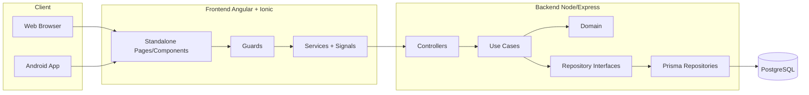

Principios aplicados:

- Separación de responsabilidades por capas.
- Dominio desacoplado de infraestructura.
- Repositorios para acceso a persistencia.
- Frontend con rutas protegidas por guardas.
- Catálogos y roles administrables desde sistema.

---

## 3. Estructura del repositorio

```text
CnCApp/
├── backend/
│   ├── prisma/                  # schema, migraciones, seeds, utilidades de catálogo
│   ├── src/
│   │   ├── application/         # casos de uso por módulo
│   │   ├── domain/              # entidades, reglas, contratos de repositorio
│   │   ├── infrastructure/
│   │   │   ├── database/        # repositorios Prisma
│   │   │   └── web/             # controllers, routes, middlewares
│   │   ├── config/              # configuración de runtime
│   │   ├── scripts/             # scripts operativos
│   │   └── services/            # servicios transversales
│   └── ...
├── frontend/
│   ├── src/app/
│   │   ├── core/                # guards, interceptors, servicios base
│   │   ├── shared/              # componentes y utilidades comunes
│   │   ├── features/            # módulos funcionales (auth/public/admin/user/creator)
│   │   └── app.routes.ts        # composición de rutas
│   └── ...
├── android/                     # proyecto android nativo (capacitor)
├── docs/                        # documentación técnica complementaria
├── MANUAL_DE_USUARIO.md
└── MANUAL_TECNICO.md
```

---

## 4. Stack tecnológico

### 4.1 Backend

- Node.js 18+
- TypeScript
- Express
- Prisma ORM
- PostgreSQL
- JWT
- bcrypt

### 4.2 Frontend

- Angular 19 (standalone)
- Ionic 8
- Signals (estado reactivo)
- RxJS
- Capacitor 7

### 4.3 Plataforma/DevOps

- Docker / Docker Compose
- Nginx (según despliegue)
- npm scripts

---

## 5. Arquitectura backend (Clean Architecture)

### 5.1 Capas

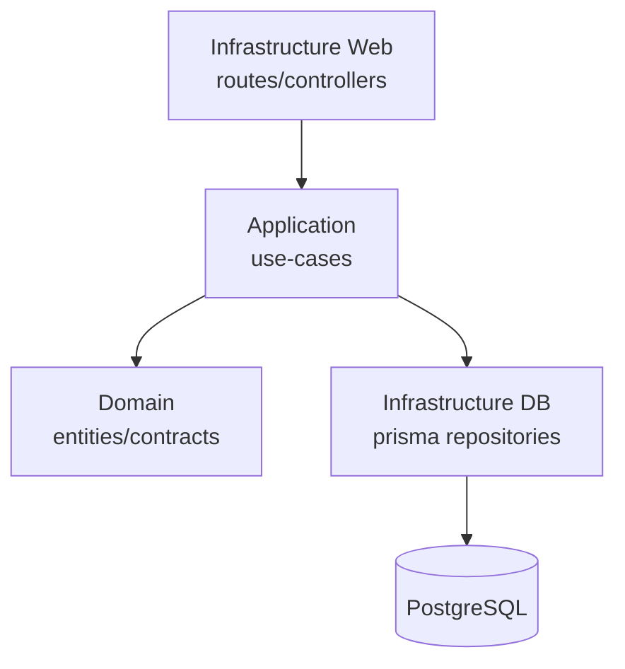

### 5.2 `domain/`

Contiene:

- Entidades de negocio.
- Contratos de repositorios.
- Utilidades puras de validación (ej. cédula).

Regla: esta capa no debe depender de Express, Prisma ni detalles de transporte.

### 5.3 `application/`

Organización por módulo (`auth`, `user`, `capacitacion`, `certificado`, `reportes`, etc.).  
Cada caso de uso:

- Recibe DTO/input.
- Aplica reglas de negocio.
- Orquesta repositorios y servicios.
- Devuelve salida de aplicación.

### 5.4 `infrastructure/database/`

Implementa contratos con Prisma:

- Traducción de modelos de dominio a tablas.
- Consultas optimizadas.
- Manejo de relaciones y filtros.

### 5.5 `infrastructure/web/`

- Rutas por módulo.
- Controllers delgados.
- Validación básica de request.
- Mapeo de errores a respuestas HTTP.

Patrón recomendado:

1. Controller extrae params/body/contexto.
2. Invoca use-case.
3. Retorna `success/data/message` consistente.

---

## 6. Arquitectura frontend (Angular + Ionic)

### 6.1 Enrutamiento

`app.routes.ts` agrega rutas de:

- `public`
- `auth`
- `admin`
- `user`
- `creator` (conferencista)

### 6.2 Guards

- `authGuard`: exige sesión.
- `adminGuard`: exige rol administrador.
- `moduleGuard`: exige módulo requerido (`route.data.requiredModule`).
- `creatorGuard`: permite conferencista/administrador.

### 6.3 Estado de autenticación

Servicio `AuthService` con señales:

- `currentUser`
- `isAuthenticated`
- `accessToken`
- `refreshToken`

Computed:

- `userName`
- `roleName`
- `modulos`

### 6.4 Convenciones de capa UI

- `features/*` por dominio funcional.
- Componentes standalone.
- Servicios por feature.
- Uso de `ChangeDetectionStrategy.OnPush` en pantallas críticas.

---

## 7. Modelo de datos y Prisma

### 7.1 Núcleo del modelo

Entidades centrales:

- `Usuario`, `Rol`, `Entidad`
- `Capacitacion`, `UsuarioCapacitacion`, `Certificado`, `Plantilla`
- `Provincia`, `Canton`, `Parroquia`, `GadParroquia`
- `InstitucionSistema`, `InstitucionUsuario`, `TipoInstitucion`
- `Competencia`, `FuncionarioGAD`, `Autoridad`
- `Genero`, `Etnia`, `Nacionalidad`, `TipoParticipante`

### 7.2 Relaciones críticas

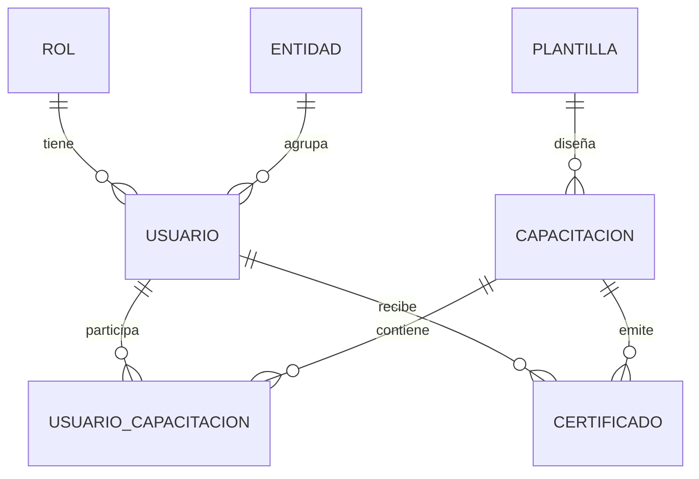

### 7.3 Índices y unicidad (ejemplos relevantes)

- `Usuario.ci` único.
- `UsuarioCapacitacion` único compuesto `(usuarioId, capacitacionId)`.
- `Certificado.codigoQR` único.
- Índices por FK para filtros/reportes.

### 7.4 Migraciones

Buenas prácticas:

- Cada cambio en `schema.prisma` debe ir acompañado de migración.
- Probar migración en entorno local limpio.
- No editar migraciones ya aplicadas en producción.

### 7.5 Seed y catálogos

`backend/prisma/seed.ts` carga:

- Roles base y módulos.
- Catálogos territoriales e institucionales.
- Datos de referencia de prueba.

Scripts auxiliares en `prisma/tools/` y `prisma/data/` soportan ingestas específicas.

---

## 8. Autenticación, autorización y sesión

### 8.1 Flujo

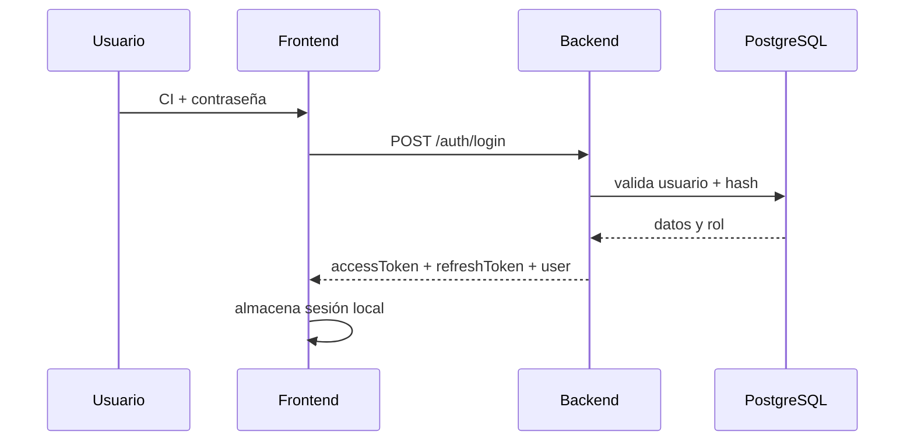

### 8.2 Autorización por módulos

- El rol posee `modulos` (JSON/array).
- Frontend evalúa acceso con `moduleGuard`.
- Backend debe validar también permisos en endpoints sensibles (defensa en profundidad).

### 8.3 Seguridad de credenciales

- Contraseñas hasheadas con `bcrypt`.
- Tokens firmados con secreto de entorno.
- No exponer secretos en repositorio.

---

## 9. Módulos funcionales y trazabilidad técnica

### 9.1 Mapa general

| Módulo | Frontend | Backend | Datos |
|--------|----------|---------|-------|
| Auth | `features/auth` | `application/auth` | `usuarios`, `roles` |
| Usuarios | `features/admin/users`, `features/user/perfil` | `application/user` | `usuarios` |
| Capacitaciones | `features/admin/capacitaciones` | `application/capacitacion` | `capacitaciones` |
| Inscripciones | `visualizarinscritos`, conferencias | `application/usuario-capacitacion` | `usuarios_capacitaciones` |
| Certificados | `features/admin/certificados`, `features/user/certificados`, `public/validar-qr` | `application/certificado` | `certificados` |
| Plantillas | `features/admin/plantillas` | `application/plantilla` | `plantillas` |
| Reportes | `features/admin/reportes` | `application/reportes` | agregados |

### 9.2 Rutas críticas

- Público: `/home/*`, `/catalogo-capacitaciones`, `/validar-certificados`
- Auth: `/login`, `/register`, `/recuperar-password`
- Usuario: `/ver-perfil`, `/ver-conferencias`, `/mis-certificados`, `/confirmar-asistencia`
- Admin: `/gestionar-*`, `/configuracion-maestros`, `/certificados/:id`
- Conferencista: `/conferencista/*`

---

## 10. Generación de certificados y validación QR

### 10.1 Emisión

Casos de uso de certificados:

- Generación individual por participante.
- Generación masiva por evento.
- Consulta por hash/QR.

Consideraciones:

- `codigoQR` único.
- Integración con plantilla y datos del evento.
- Registro de metadatos de emisión (`fechaEmision`, `pdfUrl`).

### 10.2 Validación

Pantalla pública `validar-qr`:

- Escaneo con `html5-qrcode`.
- Entrada por parámetro `hash`.
- Respuesta válida/no válida.

### 10.3 Riesgos comunes

- QR inválido por hash truncado.
- Cámara sin permisos.
- Certificados huérfanos si se alteran claves foráneas sin control.

---

## 11. Reportes y exportaciones

### 11.1 Dashboard

Incluye:

- KPIs de usuarios, capacitaciones y certificados.
- Tendencias.
- Filtros por rango de fechas, entidad, modalidad.

### 11.2 Exportación PDF

Use-case dedicado (`exportar-pdf`) expuesto al frontend.

Recomendaciones:

- Limitar tamaño de dataset por filtros.
- Añadir timeout razonable.
- Loggear errores de generación para soporte.

---

## 12. Configuración por entorno

### 12.1 Variables backend (conceptual)

- `DATABASE_URL`
- `JWT_SECRET`
- `PORT`
- CORS allowlist
- Flags de entorno (`NODE_ENV`)

### 12.2 Variables frontend

- `environment.ts` / `environment.prod.ts`
- `apiUrl`

Regla:

- Nunca hardcodear URLs/secretos en componentes.
- Centralizar configuración en `environments`.

---

## 13. Ejecución local

### 13.1 Desde raíz

```bash
npm run install:all
npm run dev:backend
npm run dev:frontend
```

### 13.2 Backend (manual)

```bash
cd backend
npm install
npm run prisma:migrate
npm run prisma:seed
npm run dev
```

### 13.3 Frontend (manual)

```bash
cd frontend
npm install
npm start
```

---

## 14. Docker y despliegue

### 14.1 Flujo estándar

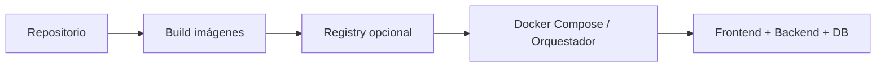

### 14.2 Recomendaciones

- Separar redes internas para backend/db.
- No exponer PostgreSQL públicamente.
- Backup periódico de base de datos.
- Healthchecks de servicios.

---

## 15. Aplicación móvil Android (Capacitor)

### 15.1 Pipeline

1. Build frontend.
2. `npx cap sync android`.
3. Abrir Android Studio.
4. Generar APK/AAB.

### 15.2 Consideraciones

- Permisos de cámara para QR.
- Pruebas en dispositivos reales.
- Validar deep links si se usan.

---

## 16. Calidad, pruebas y linting

### 16.1 Tipos de pruebas recomendadas

- Unitarias: utilidades, guards, servicios.
- Integración backend: controller + use-case + repositorio.
- E2E funcional: login, inscripción, asistencia, certificación, validación QR.

### 16.2 Casos críticos mínimos

- Login exitoso/fallido.
- Denegación por rol y por módulo.
- Crear capacitación + inscripción + asistencia.
- Generar certificado + validar QR.
- Exportar reporte PDF.

### 16.3 Lint y formateo

- ESLint backend/frontend.
- Estilo consistente TypeScript.
- Revisar warnings antes de merge.

---

## 17. Observabilidad y logging

### 17.1 Lineamientos

- Logs por request en backend (método, ruta, status, tiempo).
- Logs de errores con contexto (sin secretos).
- Identificador de correlación para trazabilidad.

### 17.2 Qué no loggear

- Contraseñas.
- Tokens completos.
- Datos personales sensibles en texto plano.

---

## 18. Seguridad técnica

### 18.1 Controles recomendados

- Hash fuerte de contraseñas.
- JWT con expiración corta + refresh token.
- CORS restrictivo.
- Rate limiting en auth.
- Sanitización/validación de input.
- Gestión segura de archivos (si aplica para firmas/fotos).

### 18.2 Riesgos a monitorear

- Escalación de privilegios por mala configuración de módulos.
- Inyección por consultas dinámicas no parametrizadas.
- Exposición accidental de `.env`.
- Dependencias vulnerables desactualizadas.

---

## 19. Runbooks operativos

### 19.1 Alta de nuevo entorno

1. Provisionar DB PostgreSQL.
2. Configurar variables seguras.
3. Ejecutar migraciones.
4. Ejecutar seed inicial (si aplica).
5. Levantar frontend/backend.
6. Pruebas smoke.

### 19.2 Rotación de secreto JWT

1. Generar nuevo secreto.
2. Aplicar en entorno.
3. Reiniciar backend.
4. Forzar relogin de sesiones.

### 19.3 Recuperación por caída

1. Validar estado de contenedores/procesos.
2. Revisar conectividad a DB.
3. Restaurar desde backup si hay corrupción.
4. Ejecutar smoke tests funcionales.

---

## 20. Troubleshooting técnico

| Síntoma | Causa probable | Acción |
|--------|-----------------|--------|
| 401 en rutas protegidas | Token ausente/expirado | Renovar sesión; revisar refresh |
| 403 acceso denegado | Rol/módulo insuficiente | Revisar `roles.modulos` y guards |
| Error Prisma P2021 | tabla no existe | Revisar migraciones aplicadas |
| QR no escanea | permisos/cámara | habilitar permisos; usar entrada manual |
| Reporte PDF falla | dataset grande/timeout | aplicar filtros; revisar logs backend |
| Front no conecta API | `apiUrl` incorrecta | validar `environment.*` |

---

## 21. Mantenimiento y evolución

### 21.1 Política recomendada de cambios

- Todo cambio funcional debe incluir:
  - actualización de rutas/guards (si aplica),
  - ajuste de use-cases/repositorios,
  - migración de BD cuando corresponda,
  - prueba funcional mínima.

### 21.2 Estrategia de versionado

- Versionado semántico por release.
- Changelog técnico por sprint.
- ADRs para decisiones de arquitectura relevantes.

### 21.3 Deuda técnica prioritaria (guía)

- Homologar nombres de roles entre UI, seed y documentación.
- Endurecer autorización backend por módulo en endpoints críticos.
- Estandarizar formato de respuestas y errores en toda API.
- Fortalecer suite E2E para ciclo completo de certificación.

---

## 22. Anexos técnicos

### 22.1 Matriz API (alto nivel)

| Dominio | Endpoint esperado (referencial) | Método |
|---------|----------------------------------|--------|
| Auth | `/auth/login`, `/auth/refresh`, `/auth/reset-password` | POST |
| Users | `/users`, `/users/:id`, `/users/profile` | GET/POST/PUT/DELETE |
| Roles | `/roles`, `/roles/:id` | GET/POST/PUT/DELETE |
| Capacitaciones | `/capacitaciones`, `/capacitaciones/:id` | GET/POST/PUT/DELETE |
| Inscripciones | `/capacitaciones/:id/inscritos`, `/inscripciones/*` | GET/POST/PUT/DELETE |
| Certificados | `/certificados/*`, `/certificados/my` | GET/POST |
| Validación | `/certificados/validate` | GET/POST |
| Reportes | `/reportes/dashboard`, `/reportes/export/pdf` | GET/POST |

> Nota: los paths exactos pueden variar según el router implementado; usar este cuadro como mapa de referencia.

### 22.2 Checklist de release técnico

- [ ] Migraciones ejecutadas sin error.
- [ ] Seed y catálogos validados (si aplica).
- [ ] Variables de entorno completas.
- [ ] Build backend/frontend exitoso.
- [ ] Smoke test de login, módulos y certificación.
- [ ] Validación pública QR operativa.
- [ ] Dashboard y exportación PDF operativos.
- [ ] Backups y monitoreo activos.

### 22.3 Checklist de auditoría de seguridad

- [ ] No hay secretos en git.
- [ ] CORS restringido a dominios autorizados.
- [ ] Contraseñas hasheadas y política de rotación definida.
- [ ] Token refresh implementado y validado.
- [ ] Accesos admin protegidos por doble control (rol+módulo).
- [ ] Dependencias revisadas con escaneo de vulnerabilidades.

---

## 23. Responsables por sección (RACI documental)

RACI: **R** Responsible, **A** Accountable, **C** Consulted, **I** Informed.

| Sección | Arquitectura | Backend | Frontend | QA | DevOps | Seguridad | Funcional |
|---------|--------------|---------|----------|----|--------|-----------|-----------|
| 1-4 Contexto y stack | A/R | C | C | I | C | C | C |
| 5 Backend | A | R | I | C | C | C | I |
| 6 Frontend | A | I | R | C | I | C | C |
| 7 Modelo de datos | A | R | I | C | C | C | C |
| 8 Seguridad sesión/roles | C | R | R | C | C | A | I |
| 9-11 Módulos funcionales | A | R | R | C | I | C | C |
| 12 Configuración entorno | C | C | C | I | A/R | C | I |
| 13-15 Ejecución y despliegue | I | C | C | C | A/R | C | I |
| 16 Calidad y pruebas | C | C | C | A/R | I | C | I |
| 17-20 Operación y soporte | C | C | I | C | R | A | I |
| 21 Evolución técnica | A | R | R | C | C | C | C |
| 22-25 Anexos auditables | A | C | C | C | C | R | C |

### 23.1 Owner sugerido por dominio

- **Arquitectura global:** Líder técnico.
- **Backend y datos:** Tech lead backend / DBA.
- **Frontend y UX técnica:** Tech lead frontend.
- **Seguridad:** Responsable de seguridad de la información.
- **Operación:** DevOps/SRE.
- **Calidad:** QA lead.
- **Gobierno funcional:** Product owner / área CNC designada.

---

## 24. Matriz de cumplimiento normativo

> Esta matriz es de referencia técnica para auditoría interna. La conformidad formal requiere validación documental y operativa por el área competente.

### 24.1 ISO/IEC 27001 (controles relevantes)

| Control (referencia) | Objetivo | Implementación en CnCApp | Evidencia esperada | Estado |
|----------------------|----------|---------------------------|--------------------|--------|
| Control de acceso | Restringir acceso a activos | Roles + módulos + guards + JWT | Config de roles, pruebas 401/403, logs | Parcial/Implementado |
| Gestión de credenciales | Proteger autenticación | Hash bcrypt + token + refresh | Código auth, pruebas de login, política de claves | Parcial |
| Seguridad en desarrollo | Reducir defectos de seguridad | Separación por capas, validaciones, revisión técnica | PR reviews, checklist release | Parcial |
| Gestión de cambios | Controlar modificaciones | Migraciones prisma + versionado de docs | Historial de cambios y migraciones | Implementado |
| Registro y monitoreo | Trazabilidad operativa | Logging backend/frontend (según entorno) | Logs centralizados, runbooks | Parcial |
| Continuidad y respaldo | Recuperación ante incidentes | Runbooks + backups DB (operativo) | Evidencia de backup/restore test | Pendiente/Parcial |

### 24.2 ENS (Esquema Nacional de Seguridad) — nivel básico (orientativo)

| Principio ENS | Aplicación técnica en CnCApp | Evidencia |
|---------------|-------------------------------|-----------|
| Seguridad integral | Controles en frontend, backend y datos | Arquitectura y manual técnico |
| Gestión de riesgos | Identificación de riesgos (auth, permisos, exposición secretos) | Secciones 18 y 20 |
| Prevención, detección, respuesta | Guards, validaciones, troubleshooting y runbooks | Secciones 8, 19, 20 |
| Reevaluación periódica | Checklists de release/auditoría | Sección 22 |
| Función diferenciada | RACI por dominio y segregación de roles | Sección 23 |

### 24.3 OWASP ASVS (mapeo resumido)

| ASVS categoría | Cobertura objetivo | Implementación actual (resumen) | Acción recomendada |
|----------------|--------------------|----------------------------------|--------------------|
| V1 Arquitectura | Diseño seguro | Capas separadas + principios de dominio | Añadir threat model formal |
| V2 Autenticación | Login seguro y sesión | JWT + refresh + bcrypt | Endurecer políticas de lockout/rate-limit |
| V3 Gestión de sesión | Control token | Señales auth + guards | Rotación y revocación centralizada |
| V4 Control de acceso | Autorización por función | adminGuard/moduleGuard/creatorGuard | Reforzar verificación server-side por módulo |
| V5 Validación/sanitización | Entradas confiables | Validaciones en capas | Estandarizar schema validation en todos endpoints |
| V7 Manejo de errores | No filtrar detalles sensibles | Mapeo de errores y mensajes | Unificar formato de error global |
| V8 Protección de datos | Minimizar exposición | Separación de datos y acceso por rol | Cifrado adicional de campos sensibles (si aplica) |
| V9 Logging/monitoring | Detectar abuso/incidentes | Logs operativos | Centralizar SIEM y alertas |
| V14 Configuración | Hardening por entorno | `env` + docker + scripts | Baselines CIS y escaneo continuo |

---

## 25. Plan de evidencias de auditoría

### 25.1 Evidencias mínimas por release

| Tipo de evidencia | Descripción | Responsable | Ubicación sugerida |
|-------------------|-------------|-------------|--------------------|
| Evidencia de build | Logs de build backend/frontend | DevOps | `docs/auditoria/<release>/build/` |
| Evidencia de migración | Resultado de migraciones Prisma | Backend/DBA | `docs/auditoria/<release>/db/` |
| Evidencia de pruebas | Reportes unit/integration/e2e | QA | `docs/auditoria/<release>/qa/` |
| Evidencia de seguridad | Escaneo de dependencias y checklist | Seguridad | `docs/auditoria/<release>/security/` |
| Evidencia funcional | Capturas o actas de UAT | Funcional/QA | `docs/auditoria/<release>/uat/` |
| Evidencia de operación | Backup/restore test y healthchecks | DevOps | `docs/auditoria/<release>/ops/` |

### 25.2 Checklist de cierre de auditoría

- [ ] Control documental actualizado (versión, cambios, aprobaciones).
- [ ] Matriz de cumplimiento revisada y estado actualizado.
- [ ] Evidencias cargadas por release.
- [ ] Hallazgos y plan de remediación registrados.
- [ ] Aprobación final de seguridad y operación.

### 25.3 Convención de versionado de evidencias

- Carpeta: `docs/auditoria/YYYY-MM-release-X/`
- Archivo índice: `README.md` con:
  - alcance de auditoría,
  - fecha,
  - participantes,
  - resultado (aprobado / aprobado con observaciones / rechazado),
  - compromisos de remediación.

---

## 26. Arquitectura C4 (detalle profesional)

### 26.1 Contexto (C4-L1)

```mermaid
flowchart LR
  EndUser[Usuarios finales<br/>Admin/Conferencista/Participante]
  Public[Validador externo<br/>sin cuenta]
  CnCApp[CnCApp / CNC Portal]
  Mail[Servicios externos de correo<br/>(si aplica)]

  EndUser --> CnCApp
  Public --> CnCApp
  CnCApp --> Mail
```

### 26.2 Contenedores (C4-L2)

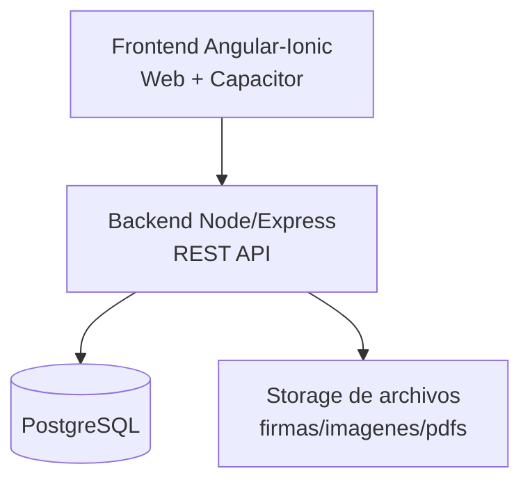

### 26.3 Componentes backend (C4-L3 simplificado)

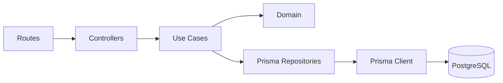

### 26.4 Componentes frontend (C4-L3 simplificado)

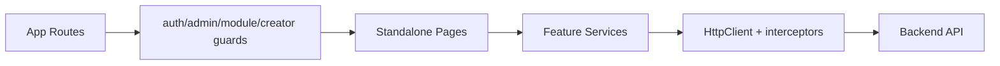

---

## 27. Requisitos no funcionales y SLO

### 27.1 NFR objetivo

| Categoría | Objetivo | Métrica |
|----------|----------|---------|
| Disponibilidad | Alta disponibilidad en horario operativo | >= 99.5% mensual |
| Rendimiento API | Respuesta ágil en operaciones comunes | p95 < 800 ms en GET críticos |
| Rendimiento UI | Interacción fluida | LCP < 2.5 s en páginas principales |
| Seguridad | Acceso mínimo necesario | 0 endpoints críticos sin control de autorización |
| Integridad de datos | Consistencia transaccional | 0 duplicidad en llaves únicas críticas |
| Recuperación | Restauración ante falla | RTO <= 4h, RPO <= 24h (objetivo inicial) |

### 27.2 SLI/SLO operativos recomendados

| Servicio | SLI | SLO | Fuente de medición |
|----------|-----|-----|--------------------|
| API | tasa de error 5xx | < 1% | logs + APM |
| API Auth | latencia login p95 | < 1.2s | métricas endpoint |
| DB | tiempo de consulta p95 | < 300ms en catálogos | pg_stat_statements |
| Front | errores JS por sesión | < 1% | monitoreo frontend |
| QR validación | éxito de validación | > 98% solicitudes correctas | logs endpoint validación |

---

## 28. Contratos técnicos de API

### 28.1 Estándar de respuesta recomendado

```json
{
  "success": true,
  "data": {},
  "message": "Operacion completada",
  "meta": {
    "requestId": "uuid-opcional",
    "timestamp": "2026-03-24T00:00:00Z"
  }
}
```

### 28.2 Estándar de error recomendado

```json
{
  "success": false,
  "error": {
    "code": "AUTH_FORBIDDEN",
    "message": "No tienes permisos para acceder a este recurso"
  },
  "meta": {
    "requestId": "uuid-opcional",
    "timestamp": "2026-03-24T00:00:00Z"
  }
}
```

### 28.3 Códigos de estado por tipo de caso

| Caso | Código |
|------|--------|
| Operación exitosa | 200 / 201 |
| Validación de entrada | 400 |
| No autenticado | 401 |
| No autorizado | 403 |
| No encontrado | 404 |
| Conflicto de unicidad | 409 |
| Error interno | 500 |

### 28.4 Versionado de API

- Estrategia sugerida: `/api/v1/...`
- Cambios incompatibles: nueva versión mayor (`v2`).
- Cambios compatibles: mantener versión y documentar en changelog.

---

## 29. Flujos E2E críticos

### 29.1 Login + navegación por módulo

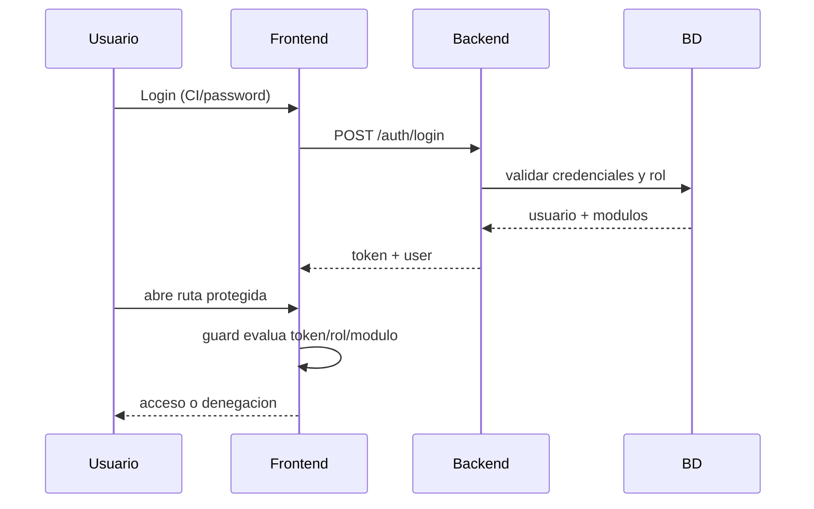

### 29.2 Ciclo completo de capacitación a certificado

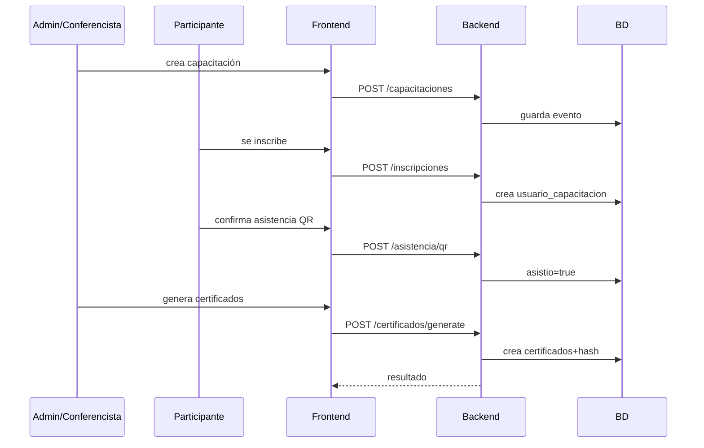

### 29.3 Validación pública QR

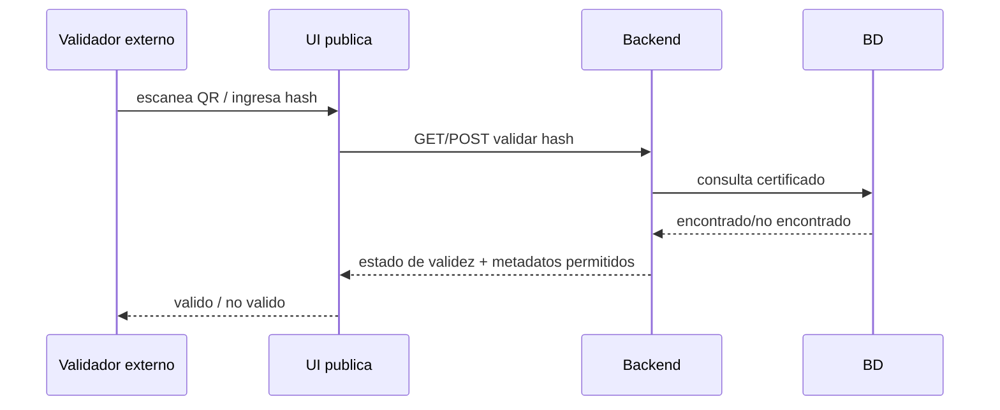

---

## 30. CI/CD y estrategia de releases

### 30.1 Pipeline recomendado

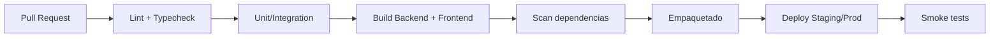

### 30.2 Gates mínimos

- `lint` y `typecheck` obligatorios.
- pruebas críticas E2E de negocio.
- escaneo de dependencias sin vulnerabilidades críticas abiertas.
- migraciones aplicables verificadas en staging.

### 30.3 Política de release

| Tipo | Ejemplo | Reglas |
|------|---------|--------|
| Hotfix | bug crítico en auth | rama corta, pruebas de regresión focales |
| Minor | mejora de reportes | backward compatible |
| Major | cambio de contrato API | requiere plan de migración y comunicación |

---

## 31. Gobierno de arquitectura y estándares

### 31.1 ADR (Architecture Decision Records)

Para decisiones relevantes, crear documento ADR en `docs/adr/` con:

- contexto del problema,
- alternativas consideradas,
- decisión tomada,
- impacto,
- fecha y responsables.

### 31.2 Definition of Done técnico (DoD)

- [ ] código cumple estándares del proyecto,
- [ ] pruebas automatizadas relevantes,
- [ ] documentación técnica actualizada,
- [ ] seguridad revisada,
- [ ] observabilidad mínima incorporada,
- [ ] sin regresiones funcionales críticas.

### 31.3 Estándares de codificación

- TypeScript estricto y tipado explícito en capas de contrato.
- Controllers delgados; lógica de negocio en use-cases.
- Evitar lógica compleja en templates frontend.
- Validación temprana de input.
- Errores con códigos estables y trazables.

### 31.4 Política de compatibilidad

- Mantener contratos API estables en versión vigente.
- Marcar campos/endpoints en deprecación antes de retirarlos.
- Ventana sugerida de compatibilidad para consumidores: 1-2 releases.

---

## 32. Matriz de riesgos técnicos

### 32.1 Escala de valoración

- **Probabilidad (P):** 1 (baja) a 5 (muy alta)
- **Impacto (I):** 1 (bajo) a 5 (crítico)
- **Riesgo inherente (R):** `P x I`
- **Nivel:** Bajo (1-6), Medio (8-12), Alto (15-19), Crítico (20-25)

### 32.2 Riesgos priorizados

| ID | Riesgo | Categoría | P | I | R | Nivel | Controles actuales | Mitigación recomendada | Owner |
|----|--------|-----------|---|---|---|-------|--------------------|------------------------|-------|
| RT-01 | Escalación de privilegios por módulo mal asignado | Acceso | 3 | 5 | 15 | Alto | guards en frontend, roles con módulos | validación server-side por módulo en endpoints críticos + pruebas de autorización | Backend/Sec |
| RT-02 | Exposición de secretos en repositorio o logs | Seguridad | 2 | 5 | 10 | Medio | uso de `.env` | secret scanning CI + política de rotación + mascarado de logs | DevOps/Sec |
| RT-03 | Vulnerabilidades en dependencias npm | Supply Chain | 4 | 4 | 16 | Alto | actualización periódica manual | SCA automático en pipeline + política de parcheo mensual | DevOps |
| RT-04 | Falla de integridad en inscripciones/certificados | Datos | 2 | 5 | 10 | Medio | constraints prisma (unique/FK) | transacciones explícitas en operaciones compuestas + pruebas de consistencia | Backend/DBA |
| RT-05 | Reutilización maliciosa de QR/códigos | Fraude | 3 | 4 | 12 | Medio | código único por certificado | añadir validación temporal/contextual opcional y trazabilidad de consultas | Backend/Sec |
| RT-06 | Denegación de servicio en endpoints de auth/validación | Disponibilidad | 3 | 4 | 12 | Medio | controles básicos | rate limit estricto + WAF/thresholds + caching de lectura | DevOps/Backend |
| RT-07 | Pérdida de datos por backup insuficiente | Continuidad | 2 | 5 | 10 | Medio | runbooks generales | backup automatizado + restauración probada trimestral | DevOps/DBA |
| RT-08 | Inconsistencias entre entorno y migraciones | Operación | 3 | 3 | 9 | Medio | migraciones Prisma | gate CI: verificación de esquema + checklist de despliegue | Backend/DevOps |
| RT-09 | Errores de autorización por cambios de rol en caliente | Seguridad funcional | 3 | 3 | 9 | Medio | relogin manual en ciertos cambios | invalidación de sesiones ante cambio de rol + notificación consistente | Backend/Frontend |
| RT-10 | Degradación de performance en reportes PDF | Rendimiento | 3 | 3 | 9 | Medio | filtros en frontend | paginación/agregación optimizada + timeout controlado + colas opcionales | Backend |

### 32.3 Mapa de calor (referencial)

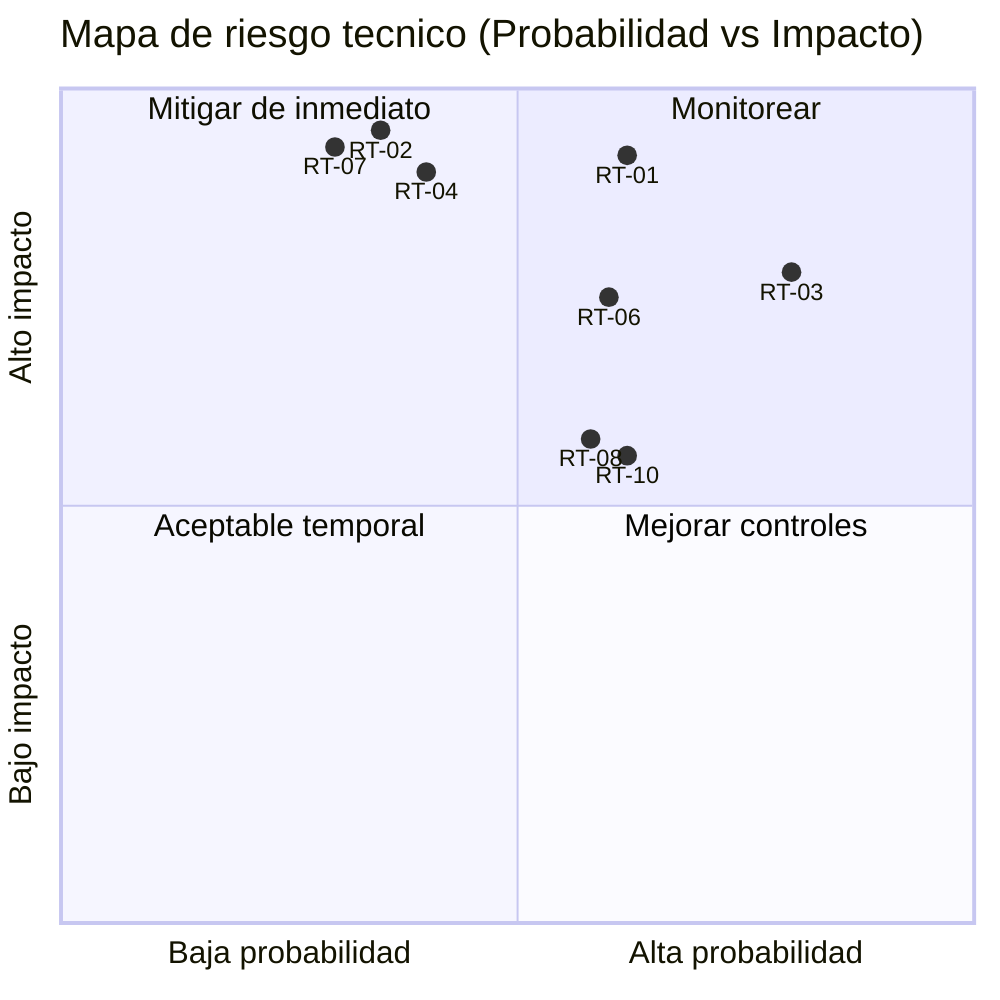

### 32.4 Plan de tratamiento por oleadas

| Fase | Horizonte | Objetivo | Entregables |
|------|-----------|----------|-------------|
| O1 | 0-30 días | Reducir riesgo crítico/alto | autorización server-side por módulo, escaneo secretos, SCA pipeline |
| O2 | 31-60 días | Endurecer disponibilidad e integridad | rate-limit avanzado, pruebas de restore, transacciones críticas |
| O3 | 61-90 días | Madurez operativa | monitoreo SLO automatizado, gestión formal de excepciones de riesgo |

---

## 33. Modelo de amenazas STRIDE

### 33.1 Alcance del modelo

Superficies analizadas:

- flujo de autenticación (`/auth/login`, refresh, sesión),
- rutas protegidas por rol/módulo,
- emisión y validación de certificados QR,
- endpoints de reportes y exportación.

Activos críticos:

- identidad de usuario,
- tokens de sesión,
- permisos por rol/módulo,
- integridad de certificados,
- datos personales y trazas operativas.

### 33.2 Diagrama de flujo de confianza

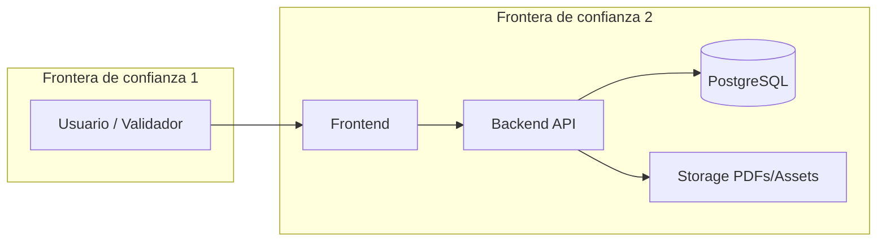

### 33.3 Matriz STRIDE por amenaza

| ID | STRIDE | Escenario de amenaza | Vector | Impacto | Controles actuales | Mitigaciones adicionales |
|----|--------|----------------------|--------|---------|--------------------|--------------------------|
| ST-01 | S (Spoofing) | Suplantación por robo de token | token expuesto en cliente/dispositivo | acceso no autorizado | JWT + guards | expiración corta, rotación refresh, revocación por servidor |
| ST-02 | T (Tampering) | Manipulación de payload en requests | cliente modificado/proxy | corrupción de datos | validación básica + dominio | schema validation centralizada + firmas de integridad cuando aplique |
| ST-03 | R (Repudiation) | Usuario niega operación sensible | ausencia de trazabilidad fuerte | conflicto legal/auditoría | logs parciales | `requestId`, auditoría inmutable y sello temporal |
| ST-04 | I (Information Disclosure) | Exposición de PII o secretos | errores verbosos / logs | incumplimiento normativo | mensajes controlados | clasificación de datos + redacción de logs + DLP |
| ST-05 | D (Denial of Service) | Saturación login/validación QR | flooding endpoint | indisponibilidad | controles generales | rate-limit por IP/user-agent + WAF + circuit breakers |
| ST-06 | E (Elevation of Privilege) | Bypass de permisos por módulo | endpoint sin check server-side | acceso administrativo | guard frontend | middleware de autorización backend por recurso y acción |
| ST-07 | T/I | Falsificación de certificado QR | QR clonado/copiado | fraude reputacional | hash único por certificado | verificación de revocación, firma digital del payload, telemetría anti-fraude |
| ST-08 | R/I | Exportación de reportes no auditada | abuso de endpoint PDF | fuga de datos | auth de ruta | auditoría de exportaciones + watermark/registro de descarga |

### 33.4 Controles por capa (defensa en profundidad)

| Capa | Controles |
|------|-----------|
| Frontend | guards, sanitización de UI, manejo de sesión local seguro, política de rutas |
| API | autenticación JWT, autorización por rol/módulo, validación de entrada, rate-limit |
| Dominio | reglas de negocio y consistencia de estados |
| Datos | restricciones de integridad, mínimos privilegios de DB, backup/restore |
| Operación | CI/CD con escaneo, observabilidad, alertas, runbooks de incidentes |

### 33.5 Backlog de hardening de seguridad

| Prioridad | Acción | Tipo |
|-----------|--------|------|
| P1 | Implementar autorización por módulo en backend para endpoints críticos | Preventivo |
| P1 | Activar secret scanning y SCA como gate de CI | Preventivo |
| P1 | Añadir rate limiting específico para auth y validar QR | Preventivo |
| P2 | Trazabilidad de acciones sensibles con `requestId` | Detectivo |
| P2 | Auditoría de descargas/exportaciones de certificados y reportes | Detectivo |
| P3 | Firma digital/verificación robusta de payload QR | Preventivo |
| P3 | Simulacros periódicos de respuesta a incidentes | Correctivo |

### 33.6 Ejercicio de threat modeling (procedimiento recomendado)

1. Definir alcance de release (módulos tocados).
2. Actualizar DFD y fronteras de confianza.
3. Revisar amenazas STRIDE por componente.
4. Calificar riesgo (probabilidad/impacto).
5. Definir mitigaciones y owners.
6. Registrar decisiones en ADR + evidencias de auditoría.

---

## Cierre

Este manual técnico debe mantenerse versionado junto al código y actualizarse en cada cambio de arquitectura, seguridad, modelo de datos o despliegue.

**Documento relacionado:** `MANUAL_DE_USUARIO.md`  
**Documentación complementaria:** carpeta `docs/`

