# 🏛️ Arquitectura del Sistema - CnCApp

## Visión General

CnCApp es un sistema full-stack moderno para la gestión de capacitaciones y certificaciones, construido con una arquitectura limpia y modular que separa claramente las responsabilidades y facilita el mantenimiento y escalabilidad.

---

## 📐 Diagrama General del Sistema


---

## 🎯 Principios Arquitectónicos

### 1. Separación de Concerns
- **Frontend**: Presentación y experiencia de usuario
- **Backend**: Lógica de negocio y acceso a datos
- **Base de Datos**: Persistencia de datos

### 2. Clean Architecture (Backend)
- **Domain Layer**: Entidades y lógica de negocio pura
- **Application Layer**: Casos de uso y orquestación
- **Infrastructure Layer**: Implementaciones técnicas

### 3. Modularidad (Frontend)
- Organización por módulos de negocio
- Standalone Components (sin NgModules)
- Servicios encapsulados por módulo

### 4. Seguridad por Capas
- Validación en frontend y backend
- Autenticación JWT
- Autorización basada en roles

---

## 🔧 Backend - Clean Architecture

### Estructura de Capas

```
backend/src/
├── domain/              # Capa de Dominio (Entidades y Reglas de Negocio)
│   ├── auth/
│   │   ├── entities/
│   │   ├── repositories/
│   │   └── mappers/
│   ├── user/
│   ├── capacitacion/
│   ├── certificado/
│   └── shared/
│
├── application/         # Capa de Aplicación (Casos de Uso)
│   ├── auth/
│   │   ├── use-cases/
│   │   └── dtos/
│   ├── user/
│   ├── capacitacion/
│   ├── certificado/
│   └── shared/
│
└── infrastructure/      # Capa de Infraestructura (Implementaciones)
    ├── database/
    │   └── repositories/
    │       ├── auth/
    │       ├── user/
    │       ├── capacitacion/
    │       └── certificado/
    ├── security/
    │   ├── bcrypt-password-hasher.ts
    │   └── jwt-token-provider.ts
    └── web/
        ├── controllers/
        ├── middleware/
        └── routes/
```

### Flujo de Datos (Backend)


### Responsabilidades por Capa

#### Domain Layer (Dominio)
- **Entidades**: Modelos de negocio puros
- **Interfaces de Repositorio**: Contratos de persistencia
- **Mappers**: Conversión entre capas
- **Reglas de Negocio**: Lógica de dominio

**Ejemplo**:
```typescript
// domain/user/entities/user.entity.ts
export class User {
  constructor(
    public readonly id: number,
    public readonly ci: string,
    public readonly email: string,
    public readonly nombre: string,
    // ...
  ) {}
  
  // Métodos de negocio
  isActive(): boolean {
    return this.estado === 1;
  }
}
```

#### Application Layer (Aplicación)
- **Use Cases**: Orquestación de lógica de negocio
- **DTOs**: Objetos de transferencia de datos
- **Interfaces de Servicios**: Contratos de servicios externos

**Ejemplo**:
```typescript
// application/auth/use-cases/login.use-case.ts
export class LoginUseCase {
  constructor(
    private userRepository: IUserRepository,
    private passwordHasher: IPasswordHasher,
    private tokenProvider: ITokenProvider
  ) {}
  
  async execute(dto: LoginDTO): Promise<LoginResponseDTO> {
    // Orquestación de la lógica
  }
}
```

#### Infrastructure Layer (Infraestructura)
- **Repositorios**: Implementaciones con Prisma
- **Servicios de Seguridad**: JWT, Bcrypt
- **Controllers**: Manejo de HTTP
- **Middleware**: Autenticación, validación, errores

**Ejemplo**:
```typescript
// infrastructure/database/repositories/user/prisma-user.repository.ts
export class PrismaUserRepository implements IUserRepository {
  async findByCI(ci: string): Promise<User | null> {
    const userData = await prisma.usuario.findUnique({ where: { CI: ci } });
    return userData ? UserMapper.toDomain(userData) : null;
  }
}
```

---

## 🎨 Frontend - Arquitectura Modular

### Estructura de Módulos

```
frontend/src/app/
├── core/                # Servicios Singleton y Guards
│   ├── guards/
│   │   └── auth.guard.ts
│   └── services/
│       └── role-checker.service.ts
│
├── shared/              # Código Compartido
│   ├── models/
│   ├── services/
│   │   └── catalogo.service.ts
│   └── components/
│
├── pages/               # Módulos de Negocio
│   ├── auth/
│   │   ├── login/
│   │   ├── register/
│   │   ├── recuperar-password/
│   │   └── services/
│   │       └── auth.service.ts
│   │
│   ├── user/
│   │   ├── perfil/
│   │   ├── conferencias/
│   │   └── services/
│   │       ├── usuario.service.ts
│   │       └── recuperacion-data-usuario.service.ts
│   │
│   ├── admin/
│   │   ├── crudcapacitaciones/
│   │   │   └── services/
│   │   │       └── capacitaciones.service.ts
│   │   └── certificados/
│   │       └── services/
│   │           └── certificados.service.ts
│   │
│   └── apps/
│       └── validar-qr/
│
├── home/                # Página Principal
│   └── pages/
│
├── app.component.ts
├── app.component.html
└── app.routes.ts
```

### Flujo de Datos (Frontend)


### Standalone Components

CnCApp usa **Standalone Components** (Angular 19) sin NgModules:

```typescript
@Component({
  selector: 'app-login',
  templateUrl: './login.page.html',
  styleUrls: ['./login.page.scss'],
  standalone: true,  // ✅ Standalone
  imports: [CommonModule, FormsModule, IonicModule]  // Imports directos
})
export class LoginPage {
  // ...
}
```

### Gestión de Estado con Signals

```typescript
// Signals para estado reactivo
export class RecuperacionDataUsuarioService {
  userName = signal<string>('');
  userRole = signal<number>(1);
  
  setUserName(name: string) {
    this.userName.set(name);
  }
}
```

---

## 🔐 Flujo de Autenticación

```mermaid
sequenceDiagram
    participant U as Usuario
    participant F as Frontend
    participant G as AuthGuard
    participant B as Backend
    participant DB as Database
    
    U->>F: Ingresa CI y Password
    F->>B: POST /api/auth/login
    B->>DB: Buscar usuario por CI
    DB-->>B: Usuario encontrado
    B->>B: Verificar password (bcrypt)
    B->>B: Generar JWT Token
    B-->>F: { token, user }
    F->>F: Guardar token en localStorage
    F-->>U: Redirigir a /home
    
    Note over U,DB: Acceso a ruta protegida
    
    U->>F: Navegar a /admin
    F->>G: canActivate()
    G->>G: Verificar token en localStorage
    G->>G: Verificar rol de usuario
    alt Token válido y rol correcto
        G-->>F: true (permitir acceso)
        F-->>U: Mostrar página admin
    else Token inválido o rol incorrecto
        G-->>F: false (denegar acceso)
        F-->>U: Redirigir a /login
    end
```



---

## 📜 Flujo de Generación de Certificados

```mermaid
sequenceDiagram
    participant U as Usuario
    participant F as Frontend
    participant B as Backend
    participant DB as Database
    participant PDF as PDFMake
    participant QR as QRCode
    
    U->>F: Solicitar certificado
    F->>B: GET /api/certificados/:id
    B->>DB: Obtener datos de capacitación
    DB-->>B: Datos de capacitación
    B->>DB: Obtener datos de usuario
    DB-->>B: Datos de usuario
    B->>B: Generar hash único (crypto)
    B->>QR: Generar código QR
    QR-->>B: Imagen QR (base64)
    B->>PDF: Generar PDF con datos
    PDF-->>B: PDF Buffer
    B->>DB: Guardar registro de certificado
    B-->>F: PDF + Metadata
    F-->>U: Descargar certificado
```



---

## 🗄️ Arquitectura de Base de Datos

### Modelo de Datos Principal


Ver [DATABASE.md](DATABASE.md) para detalles completos del schema.

---

## 🔄 Patrones de Diseño Utilizados

### Backend

| Patrón | Uso | Ubicación |
|--------|-----|-----------|
| **Repository** | Abstracción de persistencia | `domain/*/repositories/` |
| **Dependency Injection** | Inyección de dependencias | `config/di.container.ts` |
| **DTO (Data Transfer Object)** | Transferencia de datos | `application/*/dtos/` |
| **Mapper** | Conversión entre capas | `domain/*/mappers/` |
| **Middleware** | Procesamiento de requests | `infrastructure/web/middleware/` |
| **Factory** | Creación de objetos complejos | Varios |

### Frontend

| Patrón | Uso | Ubicación |
|--------|-----|-----------|
| **Service** | Lógica de negocio y HTTP | `pages/*/services/` |
| **Guard** | Protección de rutas | `core/guards/` |
| **Signals** | Estado reactivo | Servicios |
| **Standalone Components** | Componentes independientes | Todos los componentes |

---

## 🚀 Escalabilidad

### Horizontal Scaling

- **Frontend**: Servido por Nginx, fácilmente escalable
- **Backend**: Stateless, puede escalar horizontalmente
- **Base de Datos**: PostgreSQL con replicación

### Vertical Scaling

- Optimización de queries con Prisma
- Índices en base de datos
- Caching (futuro: Redis)

### Microservicios (Futuro)

La arquitectura actual permite migrar a microservicios:
- Servicio de Autenticación
- Servicio de Capacitaciones
- Servicio de Certificados
- Servicio de Catálogos

---

## 🔧 Tecnologías y Herramientas

### Backend Stack


### Frontend Stack


---

## 📊 Métricas y Monitoreo (Futuro)

### Propuestas

- **Logging**: Winston o Pino
- **Monitoring**: Prometheus + Grafana
- **Error Tracking**: Sentry
- **APM**: New Relic o Datadog

---

## 🔮 Evolución Futura

### Corto Plazo
- [ ] Implementar tests unitarios completos
- [ ] Agregar tests E2E con Cypress
- [ ] Mejorar documentación de API con Swagger

### Mediano Plazo
- [ ] Implementar caching con Redis
- [ ] Agregar WebSockets para notificaciones en tiempo real
- [ ] Implementar CI/CD completo

### Largo Plazo
- [ ] Migrar a microservicios
- [ ] Implementar Event Sourcing
- [ ] Agregar GraphQL como alternativa a REST

---

## 📚 Referencias

- [Clean Architecture - Robert C. Martin](https://blog.cleancoder.com/uncle-bob/2012/08/13/the-clean-architecture.html)
- [Angular Architecture Guide](https://angular.dev/guide/architecture)
- [Prisma Best Practices](https://www.prisma.io/docs/guides/performance-and-optimization)
- [TypeScript Handbook](https://www.typescriptlang.org/docs/handbook/intro.html)

---

<div align="center">

**[⬆ Volver al Índice](INDEX.md)**

</div>
