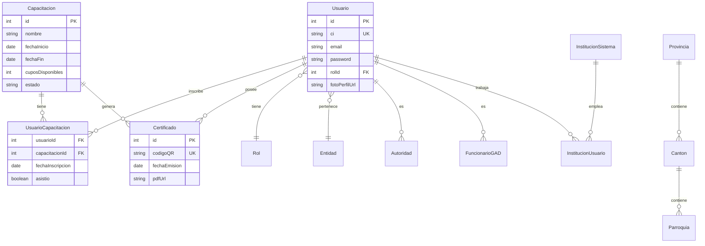

# Documentación de Base de Datos - CnCApp

## Visión General

La aplicación utiliza **PostgreSQL** como motor de base de datos relacional y **Prisma ORM** para la gestión del schema, migraciones y acceso a datos. El diseño de la base de datos está normalizado y optimizado para la integridad referencial y el rendimiento.

---

## Diagrama Entidad-Relación (ER)



---

## Descripción del Schema

### 1. Usuarios y Autenticación

#### `Usuario`
Tabla central que almacena la información de todos los actores del sistema.
- **Id_Usuario**: Primary Key, Autoincrement.
- **CI_Usuario**: Identificación única (Cédula), Unique.
- **Rol_Usuario**: Foreign Key a tabla `Rol`.
- **Tipo_Participante**: Integer (0=Ciudadano, 1=Autoridad, 2=Funcionario, 3=Institución).

#### `Rol`
Define los niveles de acceso al sistema.
- **Id_Rol**: Primary Key.
- **nombre_rol**: Ej: "Administrador", "Usuario General".
- **modulos**: JSON que define permisos específicos.

#### `Entidades`
Entidades a las que pueden pertenecer los usuarios (opcional).

### 2. Gestión de Capacitaciones

#### `Capacitaciones`
Almacena los eventos formativos.
- **Id_Capacitacion**: Primary Key.
- **Estado**: "Activa", "Finalizada", "Cancelada".
- **Cupos_Disponibles**: Control de aforo.

#### `Usuarios_Capacitaciones` (Tabla Pivote)
Gestiona la relación M:N entre Usuarios y Capacitaciones.
- **Id_Inscripcion**: Primary Key.
- **Estado_Inscripcion**: "Activa", "Cancelada", "En Espera".
- **asistio**: Boolean para control de asistencia final.

### 3. Certificaciones

#### `Certificados`
Registra los certificados emitidos.
- **Codigo_QR**: Hash único para validación pública.
- **PDF_URL**: Enlace al documento generado (si se almacena en cloud).
- **Fecha_Emision**: Timestamp de generación.

### 4. División Política (Geografía)

Estándar de división política del Ecuador.
- **Provincias**: 24 provincias.
- **Cantones**: Divisiones de provincias.
- **Parroquias**: Divisiones de cantones.

### 5. Extensiones de Perfil

Tablas para almacenar datos específicos según el `tipoParticipante`.
- **Autoridades**: Datos específicos para autoridades electas.
- **FuncionarioGAD**: Datos para funcionarios de gobiernos locales.
- **Instituciones_usuario**: Relación con instituciones públicas.

---

## Migraciones y Gestión de Cambios

Utilizamos Prisma Migrate para gestionar los cambios en el esquema de base de datos de manera segura y versionada.

### Comandos Principales

```bash
# Crear una nueva migración (después de editar schema.prisma)
npm run prisma:migrate --name nombre_descriptivo

# Aplicar migraciones pendientes (deployment)
npm run prisma:migrate:deploy

# Resetear base de datos (SOLO DESARROLLO)
npx prisma migrate reset
```

### Flujo de Trabajo para Cambios en DB

1.  Modificar `backend/prisma/schema.prisma`.
2.  Ejecutar `npm run prisma:migrate` en desarrollo.
3.  Verificar que se generó el archivo SQL en `prisma/migrations`.
4.  Commit del archivo de migración y el schema actualizado.
5.  En producción, el CI/CD ejecutará `prisma migrate deploy`.

---

## Seeding (Datos Iniciales)

El proyecto incluye un script de seed robusto que puebla la base de datos con información esencial para el funcionamiento.

### Ejecución
```bash
cd backend
npm run prisma:seed
```

### Datos Generados

1.  **Roles**: Administrador, Usuario, Autoridad, Funcionario.
2.  **Entidades Base**: Entidad principal del CNC.
3.  **Usuarios por Defecto**:
    *   Admin: CI `1712345678`, Pass: `admin123`
    *   User: CI `1787654321`, Pass: `user123`
4.  **Geografía**: Carga inicial de las 24 provincias del Ecuador.

---

## Seguridad y Best Practices

1.  **Índices**: Se han definido índices en columnas de búsqueda frecuente (`CI`, `email`, `auth_uid`, relaciones FK) para optimizar el rendimiento.
2.  **Constraints**: Uso de `Unique` para prevenir duplicados críticos (Cédula, Email, Código QR).
3.  **Cascada**: Configuración de `onDelete: Cascade` en relaciones dependientes (ej: si se borra un usuario, se borran sus inscripciones, pero NO sus certificados por razones de auditoría).
4.  **Fechas**: Uso de `@updatedAt` para tracking automático de modificaciones.
5.  **Passwords**: Las contraseñas **NUNCA** se almacenan en texto plano. Se utiliza `bcrypt` antes de la persistencia (manejado en la capa de aplicación, no en la base de datos directamente).

---

## Diccionario de Datos (Resumido)

| Tabla | Columna | Tipo | Descripción |
|-------|---------|------|-------------|
| **Usuario** | `CI_Usuario` | VARCHAR(20) | Identificador único nacional. |
| **Usuario** | `password` | VARCHAR(255) | Hash bcrypt. |
| **Capacitacion** | `Estado` | VARCHAR(50) | Estado del ciclo de vida del evento. |
| **Certificado** | `Codigo_QR` | TEXT | Hash criptográfico único. |
| **Rol** | `modulos` | JSON | Configuración de permisos dinámicos. |

---

<div align="center">

**[Volver al Índice](INDEX.md)**

</div>
