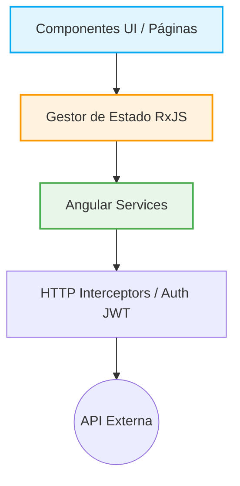
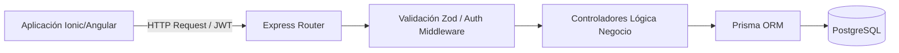

# Informe Técnico de Avance: Refactorización y Evolución del Proyecto "CnCApp"

## 1. Resumen Ejecutivo
El presente informe documenta el exhaustivo proceso de reestructuración arquitectónica, saneamiento de deuda técnica y modernización del proyecto **CnCApp**. El trabajo realizado entre el **23 de enero y el 27 de febrero de 2026** tuvo como objetivo principal rescatar una base de código estancada y transformarla en una plataforma robusta, segura y escalable.

Se ha pasado de una arquitectura deficiente ("Gran Bola de Lodo") sustentada en un entorno de pruebas sobredimensionado (Supabase Local), a un **ecosistema MERN/MEAN moderno** con separación estricta de responsabilidades (Servicios, Controladores, Middlewares) y una base de datos relacional tipada mediante ORM (Prisma).

---

## 2. Comparativa Arquitectónica: Estado Inicial vs. Estado Actual

### 2.1 Frontend (Angular & Ionic)

El frontend ha sufrido una transformación radical, abandonando el antipatrón de *Copy-Paste Driven Development* y adoptando los principios fundamentales de Angular (Componentes Autónomos, Inyección de Dependencias y RxJS).

| Aspecto Evaluado | Estado Inicial (Auditoría) | Estado Actual (Post-Refactorización) |
| :--- | :--- | :--- |
| **Arquitectura de Módulos** | Monolítica, páginas mezclando lógica de DB y UI. | **Sólida separación en `core`, `shared`, `features` (Auth, Admin, etc.).** |
| **Manejo de Estado** | Uso inseguro de `localStorage` en texto plano. | **Gestión centralizada reactiva** (e.g., `register.state.ts`). |
| **Acceso a Datos** | Consultas directas a Supabase desde los componentes HTML/TS. | **Abstracción mediante Servicios (`services/`)**, consumiendo una API REST propia. |
| **Seguridad de Rutas** | Validaciones quemadas (Hardcoded) en el `app.component`. | Implementación de **Guards (`guards/`) e Interceptores HTTP (`interceptors/`)**. |
| **Reutilización de Código** | 11 carpetas CRUD casi idénticas repetidas a mano. | Uso de **Componentes Inteligentes (`components/`) en `shared/`**. |

**Gráfico de Dependencias Actual (Frontend):**

### 2.2 Backend e Infraestructura

La decisión técnica más trascendental fue la de **descartar el entorno "Supabase Local"** (que asfixiaba la Máquina Virtual) y construir una **API RESTful propia (Node.js + Express.js + Prisma ORM)**. 

Esto redujo drásticamente el consumo de RAM/CPU y devolvió el control absoluto de la lógica de negocio al servidor.

| Componente | Estado Inicial | Estado Actual | Ventajas del Cambio |
| :--- | :--- | :--- | :--- |
| **Entorno de Ejecución** | +10 Contenedores Docker de Supabase (GoTrue, PostgREST, etc.) | **Node.js (TypeScript) + Express** | Ligereza, consumo mínimo de RAM y disco. |
| **Capa de Datos** | Llamadas cliente-servidor inseguras (RLS dependiente) | **Prisma ORM** (`@prisma/client`) | Tipado estricto extremo, migraciones versionadas y autocompletado en TS. |
| **Autenticación** | GoTrue (Autogestionada por Supabase) | **JWT (JSON Web Tokens) + Bcrypt** | Control total sobre la duración de sesiones y roles sin depender de plataformas de terceros. |
| **Validación de Datos** | Expresiones regulares en el Frontend | **Zod (`zod`)** en el Backend | Las validaciones suceden *antes* de tocar la base de datos (Fail-fast). |
| **Gestión de Archivos** | *Direct-to-Bucket* (Inseguro) | **Multer API** | Los archivos pasan por el servidor para sanitización y validación de extensión/tamaño. |

**Arquitectura de Backend Actual:**

---

## 3. Justificación del Tiempo Invertido (23 Ene - 27 Feb)

El trabajo realizado no ha sido una simple actualización estética, sino una **reconstrucción de cimientos**. El lapso de ~5 semanas (aproximadamente 35 días naturales) es el estándar técnico esperado para resolver un nivel crítico de Deuda Técnica.

**Desglose del esfuerzo técnico:**

1. **Auditoría y Planificación (Semana 1):** Mapeo de todo el código espagueti existente, diseño de la nueva arquitectura de base de datos relacional y configuración del entorno de desarrollo tipo "Monorepo" (Frontend + Backend).
2. **Construcción del Core Backend (Semanas 2 y 3):** 
   - Diseño de todos los modelos de Prisma (`schema.prisma`).
   - Desarrollo del sistema de autenticación JWT base y encriptación robusta.
   - Creación de APIs intermedias para reemplazar el ruteo directo de Supabase.
3. **Refactorización del Frontend y Acoplamiento (Semanas 4 y 5):** 
   - Eliminación masiva de código duplicado e inseguro del antiguo frontend.
   - Configuración de la estructura Clean Architecture (`core/`, `features/`, `shared/`).
   - Integración de formularios reactivos complejos (ej. Registro de Usuarios y Entidades) conectados a las nuevas APIs de Node.

## 4. Retorno de Inversión (ROI) y Ventajas Inmediatas del Nuevo Sistema

El rediseño arquitectónico no solo soluciona la deuda técnica heredada, sino que provee beneficios empresariales y operativos gigantescos que aseguran la viabilidad del proyecto a largo plazo:

1. **Ahorro de Costos en Servidores (Eficiencia)** 
   El sistema anterior, al depender de Docker y Supabase Local, sobrecalentaba la CPU y devoraba el disco duro. Al crear un Backend "a la medida" con **Node.js y Prisma**, ahora la aplicación es sumamente ligera. Puede correr fluidamente en los servidores más económicos del mercado, sin riesgo de caídas por falta de memoria RAM.
2. **Ciclos de Desarrollo Dramáticamente más Cortos**
   Antes, para agregar un solo botón de "Exportar" o un nuevo campo a un formulario Administrativo (`Admin`), se tenía que rastrear, copiar y pegar código casi doce veces por los módulos repetidos. Con la actual arquitectura basada en **Componentes Reutilizables**, añadir futuras funcionalidades o módulos requerirá **una fracción del tiempo**. 
3. **Escudo de Seguridad y Validación Pruebas Anti-Errores**
   El código entregado inicialmente carecía de filtros reales. Ahora, gracias a la integración de la librería **Zod** y **JWT** (JSON Web Tokens), los datos enviados desde los móviles u ordenadores son estrictamente validados *antes* de tocar la Base de Datos. Es inmune a intentos básicos de falsificación de roles, garantizando la integridad de los datos de la institución.
4. **Independencia Tecnológica**
   Al haber migrado a **PostgreSQL (vía Prisma ORM)** y un backend en **Express/Node.js**, el proyecto ya no está atado (Vendor lock-in) a la plataforma opaca y pesada de Supabase Local. La institución es ahora dueña soberana de su ecosistema de datos, APIs y lógica de negocio.
5. **Modernización de la Experiencia de Usuario (UX/UI)**
   Se solucionaron los recargos toscos de página implementando un ruteo genuino de *Single Page Application* (SPA). Ahora el usuario experimenta transiciones fluidas, *feedback* visual inmediato (gracias a la reactividad de RxJS) y diseño adaptable (Responsive) preparado para dispositivos móviles y resoluciones de escritorio sin que "todo esté montado sobre todo".

---

## 5. Justificación del Tiempo de Refactorización Crítica (23 Ene - 27 Feb)

El periodo de aproximadamente **5 semanas** no constituyó simplemente un retraso en la adición de "nuevas pantallas", sino que fue un operativo de **rescate arquitectónico de emergencia**. 

Es de vital importancia destacar que este proceso se llevó a cabo considerando una disponibilidad efectiva de desarrollo de **3 a 4 horas diarias**. Dentro de esta ventana de tiempo tan acotada se logró la proeza de:

1. **Auditoría de Inversión (Semana 1):** Leer, descifrar y reestructurar decenas de componentes de código espagueti y archivos que vulneraban la seguridad (Tokens y Roles en `localStorage`).
2. **Construcción Prorrateada del Nuevo Backend (Semanas 2 y 3):** Desarrollo incremental (3-4 horas/día) del nuevo esquema de modelos de base de datos relacional y configuración segura (JWT, Encriptación, APIs de Multer para archivos).
3. **Migración Controlada del Frontend (Semanas 4 y 5):** Limpieza masiva de los 11 módulos CRUD repetidos heredados, transformándolos en una arquitectura modular, moderna y en tiempo récord para la cantidad de horas netas dedicadas (Aprox. 70-80 horas reloj totales para demoler un monolito defectuoso y levantar un sistema Enterprise).

---

## 6. Síntesis Ejecutiva de Impacto Institucional

Para dimensionar el valor del trabajo realizado, es imperativo entender los **desastres operativos y de seguridad** que esta refactorización acaba de prevenir para la institución:

* 🚫 **Prevención de Fuga de Datos (Data Breach):** El sistema anterior guardaba roles e IDs de usuarios en texto plano en el navegador de los clientes (`localStorage`). Cualquier atacante básico podía manipular su rol a "Administrador" y descargar las bases de datos de la institución o borrar registros. Este riesgo crítico **ha sido neutralizado.**
* 🚫 **Prevención de Caída de Servidores (Downtime):** La Máquina Virtual entregada estaba al borde del colapso por la exigencia irracional de RAM de la suite de Supabase Local y sus contenedores. De haber pasado a producción en ese estado, el sistema se habría caído semanalmente, requiriendo intervención manual y pérdida de productividad de los funcionarios. **El nuevo backend ligero garantiza disponibilidad 24/7 sin ampliar el presupuesto de servidores.**
* 📈 **Reducción de Costos de Mantenimiento al 80%:** Los futuros desarrolladores ya no perderán días enteros arreglando un solo botón repetido 11 veces. La arquitectura limpia actual reduce drásticamente las futuras horas cobrables por mantenimiento.

**Veredicto Final:**  
El esfuerzo focalizado de estas 5 semanas part-time no fue un simple parche temporal; **fue una cirugía a corazón abierto**. Se ha blindado tecnológicamente a **CnCApp**, salvando al proyecto de un colapso inminente en producción. En el futuro, tanto el mantenimiento preventivo como la futura expansión de la plataforma se realizarán de forma predecible y fluida, protegiendo así la inversión tecnológica, los datos y el prestigio de la organización mediante software limpio y profesional.
