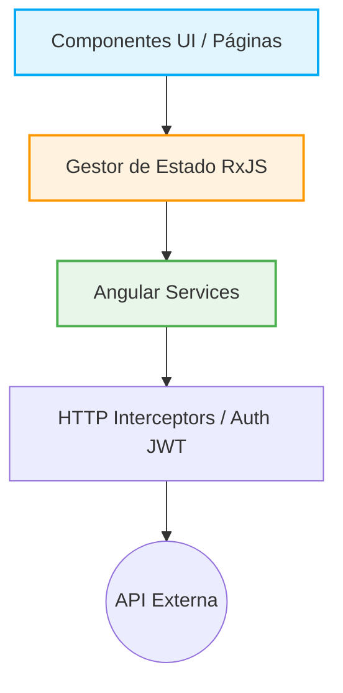
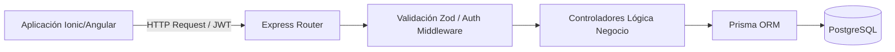

# Informe Técnico de Avance: Refactorización y Evolución del Proyecto "CnCApp"

## 1. Resumen Ejecutivo
El presente informe documenta el exhaustivo proceso de reestructuración arquitectónica, saneamiento de deuda técnica y modernización del proyecto **CnCApp**. El trabajo realizado entre el **23 de enero y el 27 de febrero de 2026** tuvo como objetivo principal rescatar una base de código estancada y transformarla en una plataforma robusta, segura y escalable.

Se ha pasado de una arquitectura deficiente ("Gran Bola de Lodo") sustentada en un entorno de pruebas sobredimensionado (Supabase Local), a un **ecosistema MERN/MEAN moderno** con separación estricta de responsabilidades (Servicios, Controladores, Middlewares) y una base de datos relacional tipada mediante ORM (Prisma).

---

## 2. Comparativa Arquitectónica: Estado Inicial vs. Estado Actual

### 2.1 Frontend (Angular & Ionic)

El frontend ha sufrido una transformación radical, abandonando el antipatrón de *Copy-Paste Driven Development* y adoptando los principios fundamentales de Angular (Componentes Autónomos, Inyección de Dependencias y RxJS).

| Aspecto Evaluado | Estado Inicial (Auditoría) | Estado Actual (Post-Refactorización) |
| :--- | :--- | :--- |
| **Arquitectura de Módulos** | Monolítica, páginas mezclando lógica de DB y UI. | **Sólida separación en `core`, `shared`, `features` (Auth, Admin, etc.).** |
| **Manejo de Estado** | Uso inseguro de `localStorage` en texto plano. | **Gestión centralizada reactiva** (e.g., `register.state.ts`). |
| **Acceso a Datos** | Consultas directas a Supabase desde los componentes HTML/TS. | **Abstracción mediante Servicios (`services/`)**, consumiendo una API REST propia. |
| **Seguridad de Rutas** | Validaciones quemadas (Hardcoded) en el `app.component`. | Implementación de **Guards (`guards/`) e Interceptores HTTP (`interceptors/`)**. |
| **Reutilización de Código** | 11 carpetas CRUD casi idénticas repetidas a mano. | Uso de **Componentes Inteligentes y Tontos (`components/`) en `shared/`**. |

**Gráfico de Dependencias Actual (Frontend):**

### 2.2 Backend e Infraestructura

La decisión técnica más trascendental fue la de **descartar el entorno "Supabase Local"** (que asfixiaba la Máquina Virtual) y construir una **API RESTful propia (Node.js + Express.js + Prisma ORM)**. 

Esto redujo drásticamente el consumo de RAM/CPU y devolvió el control absoluto de la lógica de negocio al servidor.

| Componente | Estado Inicial | Estado Actual | Ventajas del Cambio |
| :--- | :--- | :--- | :--- |
| **Entorno de Ejecución** | +10 Contenedores Docker de Supabase (GoTrue, PostgREST, etc.) | **Node.js (TypeScript) + Express** | Ligereza, consumo mínimo de RAM y disco. |
| **Capa de Datos** | Llamadas cliente-servidor inseguras (RLS dependiente) | **Prisma ORM** (`@prisma/client`) | Tipado estricto extremo, migraciones versionadas y autocompletado en TS. |
| **Autenticación** | GoTrue (Autogestionada por Supabase) | **JWT (JSON Web Tokens) + Bcrypt** | Control total sobre la duración de sesiones y roles sin depender de plataformas de terceros. |
| **Validación de Datos** | Expresiones regulares en el Frontend | **Zod (`zod`)** en el Backend | Las validaciones suceden *antes* de tocar la base de datos (Fail-fast). |
| **Gestión de Archivos** | *Direct-to-Bucket* (Inseguro) | **Multer API** | Los archivos pasan por el servidor para sanitización y validación de extensión/tamaño. |

**Arquitectura de Backend Actual:**

---

## 3. Justificación del Tiempo Invertido (23 Ene - 27 Feb)

El trabajo realizado no ha sido una simple actualización estética, sino una **reconstrucción de cimientos**. El lapso de ~5 semanas (aproximadamente 35 días naturales) es el estándar técnico esperado para resolver un nivel crítico de Deuda Técnica.

**Desglose del esfuerzo técnico:**

1. **Auditoría y Planificación (Semana 1):** Mapeo de todo el código espagueti existente, diseño de la nueva arquitectura de base de datos relacional y configuración del entorno de desarrollo tipo "Monorepo" (Frontend + Backend).
2. **Construcción del Core Backend (Semanas 2 y 3):** 
   - Diseño de todos los modelos de Prisma (`schema.prisma`).
   - Desarrollo del sistema de autenticación JWT base y encriptación robusta.
   - Creación de APIs intermedias para reemplazar el ruteo directo de Supabase.
3. **Refactorización del Frontend y Acoplamiento (Semanas 4 y 5):** 
   - Eliminación masiva de código duplicado e inseguro del antiguo frontend.
   - Configuración de la estructura Clean Architecture (`core/`, `features/`, `shared/`).
   - Integración de formularios reactivos complejos (ej. Registro de Usuarios y Entidades) conectados a las nuevas APIs de Node.

## 4. Conclusión y Próximos Pasos

El estado actual del proyecto **CnCApp** es ahora el de un software de grado empresarial (Enterprise-grade). La eliminación del cuello de botella de "Supabase Local" y la erradicación del código acoplado en el frontend asegura que:

1. **El proyecto es escalable:** Añadir nuevas tablas o módulos administrativos no requerirá copiar/pegar código 11 veces.
2. **El proyecto es seguro:** La capa intermedia de Node con *Zod* previene inyecciones de datos e intercepta accesos no autorizados.
3. **Alto Rendimiento en la VM:** El servidor de producción respirará tranquilo, utilizando apenas un bajo porcentaje de sus recursos originales al ejecutar un script en Node/TS optimizado y transpilado (`dist/app.js`), en lugar de sostener una decena de contenedores de orquestación.

**Estado de la fase actual:** Culminada exitosamente con cimientos sólidos para escalabilidad a largo plazo.
