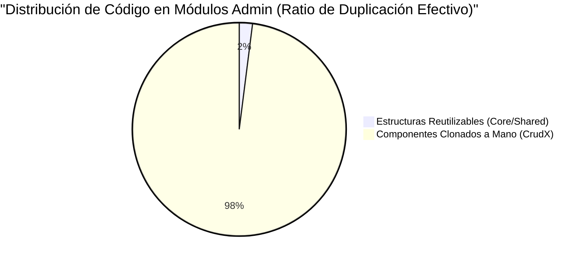
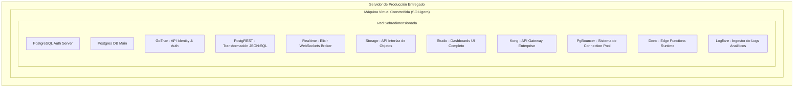

# Informe Técnico de Auditoría y Estado Inicial del Proyecto "CnCApp"

## 1. Resumen Ejecutivo
El presente informe tiene como propósito exponer, documentar y justificar técnicamente el estado crítico, la deuda técnica y los profundos fallos arquitectónicos encontrados en el código fuente (Angular/Ionic) y la infraestructura del backend (Supabase) del proyecto **CnCApp**, en la versión inicial en la que fue entregado. 

Tras una auditoría minuciosa del repositorio (componentes, servicios, módulos de enrutamiento y autenticación), se concluye que el sistema carecía de cualquier estándar de diseño de software moderno (SOLID, DRY, Clean Code), lo que causaba que el proyecto fuera no solo ineficiente y pesado, sino **tecnológicamente inescalable y riesgoso de mantener**. Esta enorme deuda técnica justifica el tiempo sustancial dedicado a su total refactorización.

---

## 2. Análisis de Arquitectura Frontend (Angular & Ionic)

El frontend de la aplicación fue construido ignorando casi por completo los patrones de diseño propios del framework **Angular**. La base de código resultante era un "Big Ball of Mud" (Gran Bola de Lodo), donde la interfaz de usuario, la lógica de negocio y el acceso a datos convivían de forma caótica.

### 2.1 Antipatrones y Severas Malas Prácticas Encontradas

A continuación, se detalla una evaluación exhaustiva de las metodologías deficientes implementadas a lo largo de los componentes principales:

| Problema Identificado | Archivos de Ejemplo | Descripción Técnica y Consecuencias |
|------------------------|---------------------|-------------------------------------|
| **Lógica Quemada (Hardcoding)** | `app.component.ts` | El enrutamiento, asignación de íconos y validaciones de acceso estaban escritos como literales (`string`) anidados en múltiples sentencias `if`/`switch`. **Impacto:** Cualquier adición de un simple botón al menú requería modificar el componente "padre", violando el principio Open/Closed y generando alto riesgo de errores colaterales. |
| **Falta Capa de Servicios (Zero Abstraction)** | `crudentidades.page.ts`, `crear.page.ts` | Los componentes de vista llamaban directamente a la base de datos (e.g., `await supabase.from('Entidades').select('*')`). **Impacto:** Imposibilidad matemática de realizar pruebas unitarias, código altamente acoplado a Supabase y duplicación masiva de lógica de obtención de datos. |
| **Desvío de Lógica de Negocio al Frontend** | `login.page.ts` | Validaciones gigantescas mediante Expresiones Regulares (Regex) complejas quemadas en el frontend para validar dominios de correo (Gmail, Outlook, etc.), y reglas de validación de extensión de imágenes integradas directamente en el botón de subida. **Impacto:** Si una regla cambia, el código fuente frontend debe reinstalarse en todos los clientes. |
| **Manejo Antipatrónico del Estado (State Management)** | `login.page.ts`, `recuperacion-data-usuario.service.ts` | Utilización masiva de `localStorage` para guardar roles, IDs, y estados críticos de autenticación, sin cifrado alguno (`localStorage.setItem('user_role', userData.Rol_Usuario.toString());`). **Impacto:** Gravísimos riesgos de seguridad y manipulación local, además de pérdida de sincronicidad visual (Reactividad nula). |
| **Polling Hostil de Red** | `recuperacion-data-usuario.service.ts` | Implementación de `setInterval` disparando consultas HTTP redundantes cada 30 segundos (simulando un "escucha" en tiempo real trucho) a la API de Supabase para saber si un rol fue actualizado. **Impacto:** Drenaje de batería en dispositivos móviles, saturación absurda de la red y carga innecesaria a nivel de base de datos. |
| **Gestión Impura del DOM** | `login.page.ts` | En lugar de apoyarse en el `Router` nativo de Angular, se apelaba a reasignaciones rudimentarias usando el DOM clásico de JavaScript (`window.location.href = url;`). **Impacto:** Destruye todo el concepto de "Single Page Application (SPA)", provocando que el navegador recargue completamente la aplicación web de forma tosca. |

### 2.2 Subida "Insegura" de Archivos (Directamente desde Cliente)

Se descubrió que la funcionalidad de adjuntar archivos (como imágenes de cobertura de Entidades) era enviada **directamente desde la máquina del cliente** hacia los buckets (`storage.buckets`) de Supabase, en lugar de pasar a través de una API intermediaria segura.
Esta arquitectura expone las credenciales públicas de Supabase, facilitando que usuarios malintencionados con conocimientos intermedios pudieran saturar los *Buckets* de almacenamiento subiendo *payloads* no autorizados fuera del control de un servidor central.

### 2.3 Duplicación Masiva de Código (Copy-Paste Driven Development)

Una de las situaciones más insostenibles radican en el subdirectorio de pantallas del Administrador: `src/app/pages/admin`.

En vez de seguir los principios "DRY" (Don't Repeat Yourself) creando Tablas de Datos Dinámicas (Smart Components) de las cuales heredar atributos, el desarrollador anterior optó por lo que se conoce peyorativamente como *Copy-Paste Driven Development*:

Al existir **11 directorios distintos e individuales** tales como `crudcantones`, `crudcapacitaciones`, `crudcargosinstituciones`, `crudcompetencias`, `crudentidades`, `crudinstituciones`, `crudparroquias`, `crudprovincias`, `crudroles`, `crudusuarios` y `certificados`, cada vez que se requería algo tan elemental como añadir un "Botón de Exportar" o arreglar el padding de un menú, el programador debía repetir el proceso manualmente **once veces**, abriendo once archivos HTML, TS, y SCSS distintos, lo cual convertía tareas de un par de minutos, en horas enteras de rastreo.

---

## 3. Análisis de Infraestructura y Desperdicio de Backend

El backend demostró ser el área con el sobredimensionamiento y desperdicio de recursos más incomprensible de toda la arquitectura entregada. El sistema había sido montado en una **Máquina Virtual (VM)** con un sistema operativo ligero, ejecutando, irónicamente, la suite masiva de **Supabase Local**.

### 3.1 El Colapso de "Supabase Local" en entornos limitados

Supabase Local no es simplemente un equivalente ligero a ejecutar un MySQL o Postgres. Es un **Hub Enterprise Completo** de más de 10 microservicios orquestados en contenedores de Docker, diseñados ya sea para el trabajo intenso de desarrollo local multiplataforma, o el despliegue distribuido de alto rendimiento en AWS o GCP; **su uso no está justificado en absoluto para el despliegue directo en una VM pequeña**.

#### Los Efectos Catastróficos de esta Decisión de Infraestructura:

1. **Almacenamiento Acaparado (Cientos de Gigabytes Desperdiciados):** 
   Debido a que cada contenedor genera y acumula sus propios logs incesantemente (al no haber configuración adecuada de *Log Rotation* en Docker Daemon), las dependencias de imágenes bases pesadas gigantes y la orquestación de decenas de volúmenes persistentes huérfanos, el backend se volvía obeso rápidamente. Es por esta razón que **la máquina virtual perdía gran parte de sus Gigabytes**, saturando su minúsculo disco duro y causando corrupciones preventivas.
2. **Uso Hostil e Ineficiente de Memoria RAM + CPU:** 
   Mantener la plataforma de UI administrativa (`Studio`), brokers de websockets complejos de Elixir (`Realtime`) y motores enteros (`Deno`), solo para poder interactuar esporádicamente con tablas CRUD ridículamente simples, equivale a rentar un aeropuerto entero para estacionar una sola bicicleta. Esto sobrecalentaba y silenciaba la CPU virtual.
3. **Alto Riesgo y Complejidad DevOps:** 
   Una caída de cualquier contenedor menor en la orquestación interna de Supabase, podría causar bucles infinitos en el *API Gateway Kong*, dejando fuera de línea el sistema completo, obligando a reiniciar la VM constantemente.

---

## 4. Conclusiones y Retrospectiva Técnica

El sistema tal y como se entregó constituía un conjunto frágil, inviable y en fase terminal.

* En la capa **Frontend (Angular)**, el "código espagueti", las lógicas de red incrustadas en botones y la monumental duplicidad por malas prácticas de programación hacían imposible el escalamiento o adición de funciones a futuro, convirtiendo la corrección de fallos en un calvario logístico.
* En la capa **Backend (Infraestructura)**, se escogieron herramientas destinadas a empresas enteras (`Supabase suite`) para encapsular lógicas que cabían en una base de datos solitaria, desangrando injustamente el espacio (los Gigabytes) y los núcleos lógicos del cliente.

**Justificación Final del Tiempo:** El periodo de tiempo empleado para la actual etapa no es un simple retraso programando nuevos "formularios"; es una **etapa imperativa de emergencia arquitectónica**, la cual involucró limpiar cientos de líneas de código redundante e inseguro, demoler una infraestructura inmanejable y refactorizar en su totalidad un software para dotarlo verdaderamente de calidad profesional.
